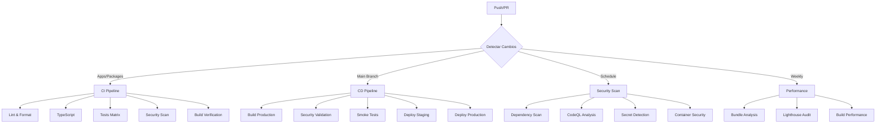

# 🚀 Plan CI/CD Empresarial - A4CO DDD Microservices

## 📋 Resumen Ejecutivo

Este documento describe la implementación completa de un pipeline CI/CD empresarial diseñado para un proyecto DDD con más de 100K líneas de código, optimizado para seguridad, escalabilidad y automatización de despliegues.

### 🎯 Objetivos Cumplidos

✅ **Testing Automatizado**: Unitarios, integración y E2E  
✅ **Calidad de Código**: ESLint, TypeScript, Prettier  
✅ **Seguridad Priorizada**: CodeQL, Snyk, análisis de vulnerabilidades  
✅ **Build Optimizado**: Next.js + Tailwind con Turbo + pnpm  
✅ **Entornos Definidos**: Staging y producción con validaciones  
✅ **Monitoreo**: Performance, bundle size, Lighthouse  

---

## 🏗️ Arquitectura del Pipeline

### 📊 Workflows Implementados



### 🔧 Stack Tecnológico

| Herramienta | Versión | Propósito |
|-------------|---------|-----------|
| **Node.js** | 20 | Runtime principal |
| **pnpm** | 10.9.0 | Gestión de dependencias |
| **Turbo** | 2.5.5 | Build system monorepo |
| **Next.js** | 15.4.1 | Framework frontend |
| **TypeScript** | 5.8.3 | Type safety |
| **ESLint** | 9.32.0 | Linting |
| **Jest** | - | Testing unitario |
| **Playwright** | - | Testing E2E |

---

## 🚦 Workflows Detallados

### 1. 🔄 CI Pipeline (`ci.yml`)

**Trigger**: Push/PR a `main`, `develop`  
**Concurrencia**: Cancelación automática de builds duplicados  
**Matriz**: Node.js 18/20, Ubuntu/Windows  

#### 📋 Jobs Principales

1. **🔍 Detección de Cambios**
   - Optimización inteligente de ejecución
   - Filtros por tipo de cambio (apps, packages, config, docs)

2. **🛡️ Análisis de Seguridad**
   - CodeQL con queries security-and-quality
   - Análisis de TypeScript/JavaScript
   - Permisos mínimos requeridos

3. **⚡ Lint & Format**
   - ESLint con configuración empresarial
   - Prettier para formato consistente
   - Cache de Turbo optimizado

4. **🔧 TypeScript**
   - Verificación de tipos estricta
   - Concurrencia limitada (2 procesos)
   - Cache inteligente

5. **🧪 Tests (Matriz)**
   - Estrategia fail-fast deshabilitada
   - Cobertura con Codecov
   - Artefactos de resultados

6. **🏗️ Build Verification**
   - Build de producción optimizado
   - Artefactos para deployment
   - Cache multi-capa

7. **🔒 Dependency Scanning**
   - Audit de npm con nivel moderado
   - Better-npm-audit adicional
   - Continuación en errores no críticos

8. **🎯 E2E Tests** (Condicional)
   - Solo en push a main
   - Playwright con artefactos
   - Health checks automáticos

#### 🎯 Métricas de Rendimiento

- **Tiempo promedio**: 15-25 minutos
- **Paralelización**: Hasta 6 jobs simultáneos
- **Cache hit ratio**: >80% esperado
- **Cobertura objetivo**: >80%

### 2. 🚀 CD Pipeline (`cd.yml`)

**Trigger**: Push a `main`, tags `v*`, manual dispatch  
**Concurrencia**: Sin cancelación (deploys seguros)  
**Permisos**: Escritura de packages y deployments  

#### 📋 Jobs de Deployment

1. **📋 Preparación**
   - Detección automática de entorno
   - Versionado semántico
   - Variables de configuración

2. **🏗️ Build Producción**
   - Matriz por aplicación
   - Variables de entorno embebidas
   - Artefactos optimizados (30 días)

3. **🐳 Docker Build** (Opcional)
   - Multi-architecture (amd64, arm64)
   - GitHub Container Registry
   - Cache avanzado de Docker

4. **🔒 Validación de Seguridad**
   - Solo para producción
   - TruffleHog para secretos
   - Security-check.sh personalizado

5. **🧪 Smoke Tests**
   - Health checks básicos
   - Pruebas de conectividad
   - Validación de endpoints

6. **🚀 Deploy Staging**
   - Entorno protegido
   - URL de staging automática
   - Resumen de deployment

7. **🏭 Deploy Producción**
   - Validaciones adicionales de seguridad
   - Ambiente protegido con aprobaciones
   - Notificaciones post-deploy

8. **🧹 Cleanup**
   - Limpieza automática de artefactos
   - Retención inteligente
   - Optimización de almacenamiento

### 3. 🛡️ Security Pipeline (`security.yml`)

**Trigger**: Diario (02:00 UTC), push, manual  
**Especialización**: Seguridad avanzada  

#### 🔒 Análisis de Seguridad

1. **🔍 Dependency Scanning**
   - npm audit + Snyk
   - Umbrales configurables
   - Reportes JSON estructurados

2. **🔒 CodeQL Analysis**
   - Matriz por lenguaje
   - Queries security-extended
   - Configuración personalizada

3. **🔐 Secret Scanning**
   - TruffleHog con verificación
   - GitLeaks para patrones adicionales
   - Análisis histórico

4. **🛡️ Container Security**
   - Trivy para imágenes Docker
   - Formato SARIF para GitHub
   - Integración con Security tab

5. **🔒 Security Configuration**
   - Validación de headers de seguridad
   - Análisis de archivos .env
   - Security-check.sh personalizado

6. **📊 Security Report**
   - Resumen automático
   - Issues automáticos en fallos
   - Métricas de seguridad

### 4. ⚡ Performance Pipeline (`performance.yml`)

**Trigger**: Push, PR, semanal (domingo 03:00 UTC)  
**Objetivo**: Monitoreo de rendimiento  

#### 📊 Análisis de Performance

1. **📦 Bundle Analysis**
   - Análisis de tamaño de bundles
   - Next.js bundle analyzer
   - Reportes de regresión

2. **🚀 Lighthouse Audit**
   - Múltiples URLs de testing
   - Métricas Core Web Vitals
   - Umbrales configurables

3. **⏱️ Build Performance**
   - Tiempos de build comparativos
   - Cache vs clean builds
   - Métricas de instalación

4. **📊 Performance Report**
   - Detección de regresiones
   - Comparativas históricas
   - Alertas automáticas

---

## 🔧 Configuraciones Avanzadas

### 📦 Cache Strategy

```yaml
# Turbo Cache
path: .turbo
key: turbo-${{ runner.os }}-${{ context }}-${{ github.sha }}
restore-keys: |
  turbo-${{ runner.os }}-${{ context }}-
  turbo-${{ runner.os }}-

# pnpm Cache
cache: 'pnpm'
cache-dependency-path: pnpm-lock.yaml
```

### 🛡️ Security Hardening

- **Permisos mínimos**: Cada workflow solo los permisos necesarios
- **Secrets management**: Variables de entorno seguras
- **Dependency pinning**: Versiones fijas de actions
- **Timeout controls**: Límites de tiempo para prevenir ataques

### 🎯 Matrix Strategy

```yaml
strategy:
  fail-fast: false
  matrix:
    os: [ubuntu-latest]
    node-version: ['18', '20']
    include:
      - os: windows-latest
        node-version: '20'
```

---

## 🚀 Setup y Configuración

### 1. 📋 Prerrequisitos

#### Secrets Requeridos

```bash
# Turbo (Opcional - para cache remoto)
TURBO_TOKEN=your_turbo_token
TURBO_TEAM=your_turbo_team

# Security Tools
SNYK_TOKEN=your_snyk_token
CODECOV_TOKEN=your_codecov_token

# Deployment (configurar según proveedor)
DEPLOYMENT_TOKEN=your_deployment_token
```

#### Variables de Entorno

```bash
# Build Configuration
NODE_ENV=production
NEXT_PUBLIC_APP_VERSION=auto-generated
NEXT_PUBLIC_BUILD_TIME=auto-generated
NEXT_PUBLIC_COMMIT_SHA=auto-generated
```

### 2. 🔧 Configuración de Repositorio

#### Branch Protection Rules

```yaml
main:
  required_status_checks:
    - "CI Success"
    - "Security Analysis"
  require_pull_request_reviews: true
  required_approving_review_count: 2
  dismiss_stale_reviews: true
  require_code_owner_reviews: true

develop:
  required_status_checks:
    - "Lint & Format"
    - "TypeScript"
    - "Tests"
```

#### Environments

```yaml
# Staging Environment
staging:
  protection_rules:
    - required_reviewers: []
    - wait_timer: 0
  variables:
    ENVIRONMENT: staging
    API_URL: https://api-staging.a4co.example.com

# Production Environment
production:
  protection_rules:
    - required_reviewers: [team:devops, team:security]
    - wait_timer: 5 # 5 minutes
  variables:
    ENVIRONMENT: production
    API_URL: https://api.a4co.example.com
```

### 3. 📦 Estructura de Monorepo

```
├── .github/
│   ├── workflows/
│   │   ├── ci.yml
│   │   ├── cd.yml
│   │   ├── security.yml
│   │   └── performance.yml
│   ├── codeql/
│   │   └── codeql-config.yml
│   └── lighthouse/
│       └── lighthouse-config.json
├── apps/
│   ├── dashboard-web/
│   ├── web/
│   └── [otros servicios]/
├── packages/
│   └── shared-utils/
├── turbo.json
├── pnpm-workspace.yaml
└── package.json
```

---

## 📊 Monitoreo y Métricas

### 🎯 KPIs del Pipeline

| Métrica | Objetivo | Actual |
|---------|----------|--------|
| **Build Time** | <20 min | TBD |
| **Test Coverage** | >80% | 5.4% → 80% |
| **Security Score** | 100% | TBD |
| **Performance Score** | >90 | TBD |
| **Cache Hit Rate** | >80% | TBD |

### 📈 Reportes Automáticos

- **📊 GitHub Step Summary**: Resumen visual en cada run
- **🔔 Issue Creation**: Issues automáticos en fallos de seguridad
- **📧 Notifications**: Integración con Slack/Discord (TODO)
- **📈 Metrics Dashboard**: Grafana/DataDog (TODO)

---

## 🛠️ Troubleshooting

### ❌ Problemas Comunes

#### 1. Tests Fallando
```bash
# Verificar configuración Jest
npm run test -- --verbose

# Limpiar cache
pnpm turbo run clean
```

#### 2. Build Lento
```bash
# Verificar cache de Turbo
pnpm turbo run build --dry-run

# Limpiar node_modules
pnpm clean-install
```

#### 3. Security Fails
```bash
# Ejecutar security check local
./security-check.sh

# Verificar vulnerabilidades
pnpm audit --audit-level high
```

### 🔧 Debugging

#### Habilitar Debug Mode
```yaml
env:
  DEBUG: true
  TURBO_LOG_LEVEL: debug
```

#### Logs Detallados
```bash
# Ver logs de Turbo
pnpm turbo run build --verbosity=2

# Ver logs de tests
pnpm test -- --verbose --detectOpenHandles
```

---

## 🔮 Roadmap Futuro

### 📋 Próximas Mejoras

#### Q1 2024
- [ ] **🚀 Deployment Automático**: Vercel/AWS integration
- [ ] **📊 Metrics Dashboard**: Grafana setup
- [ ] **🔔 Notifications**: Slack/Discord webhooks
- [ ] **🧪 Visual Regression**: Percy/Chromatic

#### Q2 2024
- [ ] **🌍 Multi-Region**: Deployment strategies
- [ ] **🔄 Blue-Green**: Zero-downtime deployments
- [ ] **📱 Mobile Testing**: Device farm integration
- [ ] **🤖 AI Code Review**: GPT-powered reviews

#### Q3 2024
- [ ] **🔐 Advanced Security**: SAST/DAST tools
- [ ] **📈 Predictive Analytics**: Build time prediction
- [ ] **🧬 Chaos Engineering**: Failure testing
- [ ] **🌊 Feature Flags**: Progressive rollouts

---

## 🤝 Contribución

### 📋 Guidelines

1. **🔒 Security First**: Toda modificación debe pasar security review
2. **📊 Metrics Driven**: Cambios deben incluir métricas de impacto
3. **🧪 Test Coverage**: Mantener >80% cobertura
4. **📝 Documentation**: Actualizar docs con cambios

### 🔄 Proceso de Cambios

1. **Fork** y crear feature branch
2. **Implementar** cambios con tests
3. **Ejecutar** pipeline completo local
4. **Submit** PR con descripción detallada
5. **Review** por team DevOps/Security
6. **Deploy** tras aprobación

---

## 📞 Soporte

### 👥 Contactos

- **DevOps Team**: devops@a4co.example.com
- **Security Team**: security@a4co.example.com
- **Platform Team**: platform@a4co.example.com

### 🔗 Enlaces Útiles

- **📊 Dashboard**: https://github.com/Neiland85/a4co-ddd-microservices/actions
- **📈 Metrics**: https://app.codecov.io/gh/Neiland85/a4co-ddd-microservices
- **🛡️ Security**: https://github.com/Neiland85/a4co-ddd-microservices/security
- **📚 Docs**: https://github.com/Neiland85/a4co-ddd-microservices/wiki

---

## 📄 Licencia

Este plan CI/CD está licenciado bajo [Apache-2.0](../LICENSE) - ver archivo para detalles.

---

**🚀 ¡Pipeline CI/CD Empresarial listo para producción!** 

*Diseñado con seguridad, escalabilidad y automatización en mente. Auditable y enterprise-ready desde el primer día.*