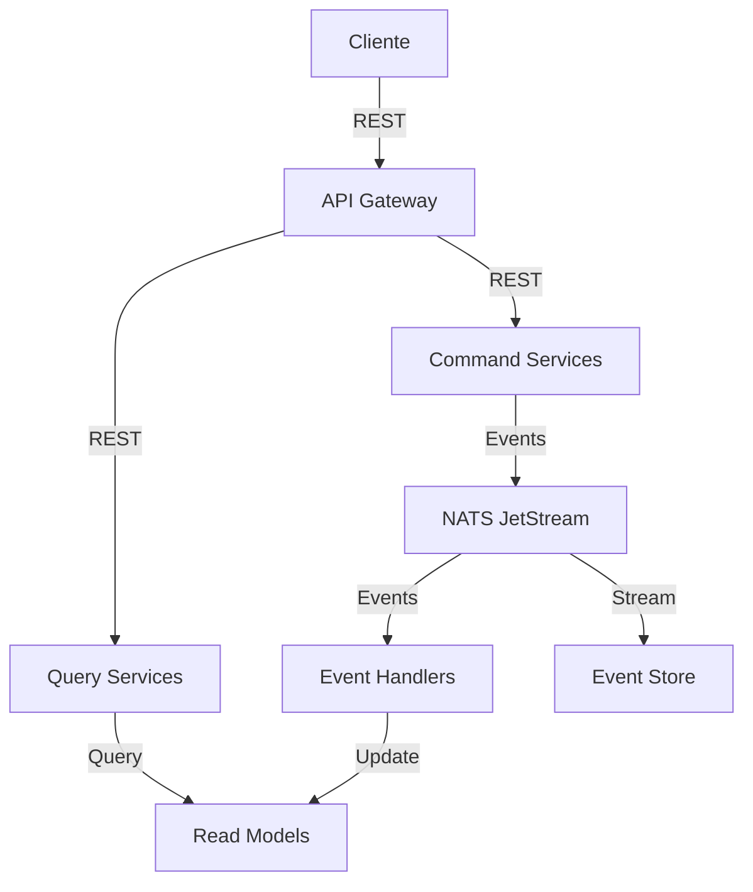

# 🔄 ESTRATEGIA DE COMUNICACIÓN ENTRE MICROSERVICIOS V2.0

**Proyecto:** A4CO DDD Microservices - Marketplace Local de Jaén  
**Fecha:** Enero 2025  
**Enfoque:** Event-Driven Architecture + Domain-Driven Design + CQRS

---

## 🎯 RESUMEN EJECUTIVO

Esta estrategia actualizada define la comunicación entre los 18 microservicios del marketplace, estableciendo patrones mejorados para interacciones síncronas (REST) y asíncronas (eventos), con un enfoque en CQRS, Event Sourcing y resiliencia.

### Principios de Comunicación Actualizados:
- **Asíncrono por defecto**: Eventos de dominio como forma principal de comunicación
- **CQRS**: Separación clara entre comandos y consultas
- **Event Sourcing**: Para servicios críticos (orders, payments)
- **Idempotencia**: Todos los mensajes/eventos son idempotentes
- **Resiliencia**: Circuit breakers, retries y dead letter queues

---

## 🏗️ ARQUITECTURA DE COMUNICACIÓN MEJORADA

### Stack de Mensajería: **NATS JetStream + Redis**

**Componentes del Stack:**
1. **NATS JetStream**: Mensajería principal con persistencia
2. **Redis**: Cache distribuido y pub/sub para notificaciones en tiempo real
3. **Prometheus + Grafana**: Métricas y monitoreo
4. **Jaeger**: Distributed tracing
5. **ELK Stack**: Logging centralizado

### Patrones de Comunicación:



---

## 📊 MATRIZ DE COMUNICACIÓN ACTUALIZADA

### Comunicación SÍNCRONA (REST APIs) - Solo para Queries y Validaciones Críticas

| Servicio Origen | Servicio Destino | Endpoint | Propósito | SLA |
|-----------------|------------------|----------|-----------|-----|
| **API Gateway** | **auth-service** | `POST /api/auth/validate-token` | Validación de autenticación | < 50ms |
| **order-service** | **inventory-service** | `GET /api/inventory/availability/{productId}` | Verificación de disponibilidad | < 100ms |
| **payment-service** | **user-service** | `GET /api/users/{userId}/payment-profile` | Perfil de pago | < 100ms |
| **dashboard-web** | **product-service** | `GET /api/products/search` | Búsqueda con facetas | < 200ms |
| **geo-service** | **artisan-service** | `GET /api/artisans/geo-search` | Búsqueda geoespacial | < 150ms |
| **admin-service** | **analytics-service** | `GET /api/analytics/real-time` | Dashboard en tiempo real | < 300ms |
| **cms-service** | **product-service** | `GET /api/products/content` | Contenido enriquecido | < 150ms |
| **chat-service** | **user-service** | `GET /api/users/{userId}/chat-profile` | Perfil para chat | < 100ms |

### Comunicación ASÍNCRONA (Eventos de Dominio) - Categorizada por Contexto

#### 🛒 Order Bounded Context

```typescript
// Comandos
export interface CreateOrderCommand {
  customerId: string;
  items: OrderItem[];
  deliveryAddress: Address;
  paymentMethodId: string;
  metadata: {
    deviceInfo: DeviceInfo;
    sessionId: string;
  };
}

// Eventos
export class OrderCreatedEvent extends DomainEvent {
  static readonly EVENT_NAME = 'order.created.v1';
  
  constructor(
    public readonly orderId: string,
    public readonly data: {
      customerId: string;
      items: OrderItem[];
      totalAmount: Money;
      deliveryAddress: Address;
      estimatedDelivery: DateRange;
      createdAt: Date;
    }
  ) {
    super(orderId, OrderCreatedEvent.EVENT_NAME);
  }
}

export class OrderStateChangedEvent extends DomainEvent {
  static readonly EVENT_NAME = 'order.state.changed.v1';
  
  constructor(
    public readonly orderId: string,
    public readonly data: {
      previousState: OrderState;
      currentState: OrderState;
      reason: string;
      changedBy: string;
      changedAt: Date;
    }
  ) {
    super(orderId, OrderStateChangedEvent.EVENT_NAME);
  }
}

export class OrderItemsModifiedEvent extends DomainEvent {
  static readonly EVENT_NAME = 'order.items.modified.v1';
  
  constructor(
    public readonly orderId: string,
    public readonly data: {
      addedItems: OrderItem[];
      removedItems: OrderItem[];
      modifiedItems: OrderItem[];
      newTotalAmount: Money;
      modifiedBy: string;
      modifiedAt: Date;
    }
  ) {
    super(orderId, OrderItemsModifiedEvent.EVENT_NAME);
  }
}
```

**Suscriptores de Order Events:**
- `OrderCreatedEvent` → inventory, payment, notification, analytics, loyalty, artisan
- `OrderStateChangedEvent` → notification, analytics, inventory (si cancelled)
- `OrderItemsModifiedEvent` → inventory, payment, notification

#### 📦 Inventory Bounded Context

```typescript
// Eventos mejorados con más contexto
export class StockReservationRequestedEvent extends DomainEvent {
  static readonly EVENT_NAME = 'inventory.reservation.requested.v1';
  
  constructor(
    public readonly reservationId: string,
    public readonly data: {
      orderId: string;
      items: Array<{
        productId: string;
        quantity: number;
        unitPrice: Money;
      }>;
      customerId: string;
      expirationTime: Date;
      priority: 'normal' | 'high' | 'vip';
    }
  ) {
    super(reservationId, StockReservationRequestedEvent.EVENT_NAME);
  }
}

export class StockReservationConfirmedEvent extends DomainEvent {
  static readonly EVENT_NAME = 'inventory.reservation.confirmed.v1';
  
  constructor(
    public readonly reservationId: string,
    public readonly data: {
      orderId: string;
      reservedItems: Array<{
        productId: string;
        quantity: number;
        warehouseId: string;
        location: string;
      }>;
      expiresAt: Date;
      totalReserved: number;
    }
  ) {
    super(reservationId, StockReservationConfirmedEvent.EVENT_NAME);
  }
}

export class StockThresholdReachedEvent extends DomainEvent {
  static readonly EVENT_NAME = 'inventory.threshold.reached.v1';
  
  constructor(
    public readonly productId: string,
    public readonly data: {
      currentStock: number;
      threshold: number;
      thresholdType: 'critical' | 'low' | 'reorder';
      artisanId: string;
      productName: string;
      lastRestockDate: Date;
      averageDailySales: number;
      estimatedStockoutDate: Date;
    }
  ) {
    super(productId, StockThresholdReachedEvent.EVENT_NAME);
  }
}
```

#### 💳 Payment Bounded Context

```typescript
// Eventos con soporte para múltiples métodos de pago
export class PaymentMethodValidatedEvent extends DomainEvent {
  static readonly EVENT_NAME = 'payment.method.validated.v1';
  
  constructor(
    public readonly validationId: string,
    public readonly data: {
      orderId: string;
      paymentMethodId: string;
      type: 'card' | 'bizum' | 'paypal' | 'transfer';
      isValid: boolean;
      validationDetails: {
        availableCredit?: Money;
        requires3DS?: boolean;
        riskScore?: number;
      };
      validatedAt: Date;
    }
  ) {
    super(validationId, PaymentMethodValidatedEvent.EVENT_NAME);
  }
}

export class PaymentProcessingStartedEvent extends DomainEvent {
  static readonly EVENT_NAME = 'payment.processing.started.v1';
  
  constructor(
    public readonly paymentId: string,
    public readonly data: {
      orderId: string;
      amount: Money;
      paymentMethod: PaymentMethod;
      customerId: string;
      processorId: string;
      startedAt: Date;
    }
  ) {
    super(paymentId, PaymentProcessingStartedEvent.EVENT_NAME);
  }
}

export class PaymentSplitCreatedEvent extends DomainEvent {
  static readonly EVENT_NAME = 'payment.split.created.v1';
  
  constructor(
    public readonly splitId: string,
    public readonly data: {
      paymentId: string;
      orderId: string;
      splits: Array<{
        recipientId: string;
        recipientType: 'artisan' | 'platform' | 'delivery';
        amount: Money;
        percentage: number;
      }>;
      totalAmount: Money;
      createdAt: Date;
    }
  ) {
    super(splitId, PaymentSplitCreatedEvent.EVENT_NAME);
  }
}
```

#### 👤 User Bounded Context

```typescript
// Eventos con más información de comportamiento
export class UserBehaviorTrackedEvent extends DomainEvent {
  static readonly EVENT_NAME = 'user.behavior.tracked.v1';
  
  constructor(
    public readonly trackingId: string,
    public readonly data: {
      userId: string;
      action: string;
      context: {
        page?: string;
        productId?: string;
        searchQuery?: string;
        filters?: Record<string, any>;
      };
      timestamp: Date;
      sessionId: string;
    }
  ) {
    super(trackingId, UserBehaviorTrackedEvent.EVENT_NAME);
  }
}

export class UserSegmentChangedEvent extends DomainEvent {
  static readonly EVENT_NAME = 'user.segment.changed.v1';
  
  constructor(
    public readonly userId: string,
    public readonly data: {
      previousSegments: string[];
      currentSegments: string[];
      triggers: Array<{
        rule: string;
        value: any;
      }>;
      changedAt: Date;
    }
  ) {
    super(userId, UserSegmentChangedEvent.EVENT_NAME);
  }
}
```

#### 🎨 Artisan Bounded Context

```typescript
// Eventos para gestión de artesanos
export class ArtisanOnboardingCompletedEvent extends DomainEvent {
  static readonly EVENT_NAME = 'artisan.onboarding.completed.v1';
  
  constructor(
    public readonly artisanId: string,
    public readonly data: {
      businessInfo: BusinessInfo;
      certifications: Certification[];
      productCategories: string[];
      deliveryCapabilities: DeliveryCapabilities;
      completedAt: Date;
      onboardingScore: number;
    }
  ) {
    super(artisanId, ArtisanOnboardingCompletedEvent.EVENT_NAME);
  }
}

export class ArtisanPerformanceEvaluatedEvent extends DomainEvent {
  static readonly EVENT_NAME = 'artisan.performance.evaluated.v1';
  
  constructor(
    public readonly artisanId: string,
    public readonly data: {
      period: DateRange;
      metrics: {
        ordersFulfilled: number;
        averageRating: number;
        onTimeDeliveryRate: number;
        customerSatisfactionScore: number;
        revenue: Money;
      };
      tier: 'bronze' | 'silver' | 'gold' | 'platinum';
      recommendations: string[];
      evaluatedAt: Date;
    }
  ) {
    super(artisanId, ArtisanPerformanceEvaluatedEvent.EVENT_NAME);
  }
}
```

#### 🔔 Notification Bounded Context

```typescript
// Eventos de notificación con prioridades
export class NotificationScheduledEvent extends DomainEvent {
  static readonly EVENT_NAME = 'notification.scheduled.v1';
  
  constructor(
    public readonly notificationId: string,
    public readonly data: {
      recipientId: string;
      type: 'email' | 'sms' | 'push' | 'in-app';
      template: string;
      variables: Record<string, any>;
      priority: 'low' | 'normal' | 'high' | 'critical';
      scheduledFor: Date;
      expiresAt?: Date;
      groupKey?: string; // Para agrupar notificaciones similares
    }
  ) {
    super(notificationId, NotificationScheduledEvent.EVENT_NAME);
  }
}

export class NotificationBatchProcessedEvent extends DomainEvent {
  static readonly EVENT_NAME = 'notification.batch.processed.v1';
  
  constructor(
    public readonly batchId: string,
    public readonly data: {
      notificationIds: string[];
      successful: number;
      failed: number;
      failures: Array<{
        notificationId: string;
        error: string;
      }>;
      processedAt: Date;
      processingTime: number;
    }
  ) {
    super(batchId, NotificationBatchProcessedEvent.EVENT_NAME);
  }
}
```

---

## 🔄 SAGAS Y ORQUESTACIÓN MEJORADA

### Order Fulfillment Saga (Mejorada)

```typescript
export class OrderFulfillmentSagaV2 {
  private readonly steps = [
    'validate-customer',
    'reserve-stock',
    'calculate-pricing',
    'validate-payment',
    'process-payment',
    'confirm-order',
    'notify-participants',
    'schedule-delivery'
  ];

  async execute(command: CreateOrderCommand): Promise<void> {
    const sagaId = uuid();
    const saga = new SagaExecution(sagaId, this.steps);
    
    try {
      // Step 1: Validate Customer
      await this.validateCustomer(command.customerId);
      saga.markStepCompleted('validate-customer');
      
      // Step 2: Reserve Stock (parallel for all items)
      const reservations = await Promise.all(
        command.items.map(item => 
          this.reserveStock(item, command.customerId)
        )
      );
      saga.markStepCompleted('reserve-stock');
      
      // Step 3: Calculate final pricing with discounts
      const pricing = await this.calculatePricing(
        command.items, 
        command.customerId,
        command.deliveryAddress
      );
      saga.markStepCompleted('calculate-pricing');
      
      // Continue with remaining steps...
      
    } catch (error) {
      // Compensating transactions
      await this.compensate(saga);
      throw error;
    }
  }
  
  private async compensate(saga: SagaExecution): Promise<void> {
    const completedSteps = saga.getCompletedSteps();
    
    // Reverse order compensation
    for (const step of completedSteps.reverse()) {
      switch (step) {
        case 'reserve-stock':
          await this.releaseStockReservations(saga.getContext());
          break;
        case 'process-payment':
          await this.refundPayment(saga.getContext());
          break;
        // ... más compensaciones
      }
    }
  }
}
```

### Inventory Replenishment Saga

```typescript
export class InventoryReplenishmentSaga {
  async handleLowStock(event: StockThresholdReachedEvent): Promise<void> {
    const saga = new SagaExecution(uuid(), [
      'analyze-demand',
      'check-supplier-availability',
      'create-purchase-order',
      'notify-artisan',
      'schedule-restock'
    ]);
    
    try {
      // Analyze historical demand
      const demandAnalysis = await this.analyzeDemand(
        event.data.productId,
        event.data.averageDailySales
      );
      
      // Check supplier availability
      const suppliers = await this.checkSuppliers(
        event.data.productId,
        demandAnalysis.recommendedQuantity
      );
      
      // Auto-create purchase order if configured
      if (event.data.artisanId && this.isAutoRestockEnabled(event.data.artisanId)) {
        await this.createPurchaseOrder(suppliers[0], demandAnalysis);
      }
      
      // Notify artisan
      await this.notifyArtisan(event);
      
    } catch (error) {
      await this.compensate(saga);
    }
  }
}
```

---

## 📡 CONFIGURACIÓN AVANZADA DE NATS

### Streams y Consumers Configuration

```typescript
// packages/shared-utils/src/nats/streams-config.ts
export const STREAM_CONFIGS = {
  orders: {
    name: 'ORDERS',
    subjects: ['order.>'],
    retention: 'limits',
    max_msgs: 1000000,
    max_age: 30 * 24 * 60 * 60 * 1000000000, // 30 días
    max_msg_size: 1024 * 1024, // 1MB
    storage: 'file',
    num_replicas: 3,
    duplicate_window: 2 * 60 * 1000000000, // 2 minutos
  },
  
  inventory: {
    name: 'INVENTORY',
    subjects: ['inventory.>'],
    retention: 'limits',
    max_msgs: 500000,
    max_age: 7 * 24 * 60 * 60 * 1000000000, // 7 días
    storage: 'file',
    num_replicas: 3,
  },
  
  payments: {
    name: 'PAYMENTS',
    subjects: ['payment.>'],
    retention: 'limits',
    max_msgs: 2000000,
    max_age: 365 * 24 * 60 * 60 * 1000000000, // 1 año (regulatorio)
    storage: 'file',
    num_replicas: 3,
    discard: 'old',
  },
  
  notifications: {
    name: 'NOTIFICATIONS',
    subjects: ['notification.>'],
    retention: 'interest', // Se eliminan cuando no hay consumidores
    max_age: 24 * 60 * 60 * 1000000000, // 24 horas
    storage: 'memory',
    num_replicas: 1,
  }
};

// Consumer configurations
export const CONSUMER_CONFIGS = {
  orderServiceInventoryConsumer: {
    stream: 'INVENTORY',
    config: {
      durable_name: 'order-service-inventory',
      filter_subject: 'inventory.reservation.>',
      ack_policy: 'explicit',
      max_deliver: 3,
      ack_wait: 30 * 1000000000, // 30 segundos
      max_ack_pending: 100,
    }
  },
  
  notificationServiceAllEventsConsumer: {
    stream: 'ORDERS',
    config: {
      durable_name: 'notification-service-orders',
      deliver_policy: 'new',
      ack_policy: 'explicit',
      max_deliver: 5,
      backoff: [1, 2, 4, 8, 16], // segundos
    }
  }
};
```

### Dead Letter Queue Implementation

```typescript
// packages/shared-utils/src/messaging/dead-letter-queue.ts
export class DeadLetterQueue {
  private readonly dlqStream = 'DLQ';
  
  async setupDLQ(): Promise<void> {
    await this.jsm.streams.add({
      name: this.dlqStream,
      subjects: ['dlq.>'],
      retention: 'limits',
      max_msgs: 100000,
      max_age: 30 * 24 * 60 * 60 * 1000000000, // 30 días
      storage: 'file',
    });
  }
  
  async sendToDeadLetter(
    originalSubject: string,
    event: DomainEvent,
    error: Error,
    attempts: number
  ): Promise<void> {
    const dlqEvent = {
      originalSubject,
      event,
      error: {
        message: error.message,
        stack: error.stack,
        name: error.name,
      },
      attempts,
      movedToDLQAt: new Date().toISOString(),
    };
    
    await this.nc.publish(
      `dlq.${originalSubject}`,
      this.codec.encode(JSON.stringify(dlqEvent))
    );
  }
  
  async processDLQ(): Promise<void> {
    const consumer = await this.js.consumers.get(this.dlqStream, 'dlq-processor');
    
    for await (const msg of consumer.consume()) {
      const dlqEvent = JSON.parse(this.codec.decode(msg.data));
      
      // Análisis y posible re-procesamiento
      if (this.canRetry(dlqEvent)) {
        await this.retryEvent(dlqEvent);
      } else {
        await this.alertOperations(dlqEvent);
      }
      
      msg.ack();
    }
  }
}
```

---

## 🔒 SEGURIDAD Y AUTENTICACIÓN MEJORADA

### Service-to-Service Authentication

```typescript
// packages/shared-utils/src/auth/service-auth.ts
export class ServiceAuthentication {
  private readonly privateKey: string;
  private readonly publicKeys: Map<string, string>;
  
  generateServiceToken(
    serviceName: string,
    targetService: string,
    expiresIn = '5m'
  ): string {
    return jwt.sign(
      {
        iss: serviceName,
        sub: targetService,
        aud: 'a4co-marketplace',
        iat: Date.now(),
        jti: uuid(), // Unique token ID for tracking
        permissions: this.getServicePermissions(serviceName),
      },
      this.privateKey,
      {
        algorithm: 'RS256',
        expiresIn,
      }
    );
  }
  
  validateServiceToken(token: string, expectedIssuer: string): boolean {
    try {
      const publicKey = this.publicKeys.get(expectedIssuer);
      if (!publicKey) throw new Error('Unknown service');
      
      const decoded = jwt.verify(token, publicKey, {
        algorithms: ['RS256'],
        audience: 'a4co-marketplace',
      });
      
      // Additional validation
      return this.validatePermissions(decoded, expectedIssuer);
    } catch (error) {
      return false;
    }
  }
}
```

### Event Encryption for Sensitive Data

```typescript
// packages/shared-utils/src/security/event-encryption.ts
export class EventEncryption {
  encrypt(event: DomainEvent, fields: string[]): DomainEvent {
    const encrypted = { ...event };
    
    fields.forEach(field => {
      const value = get(encrypted.data, field);
      if (value) {
        set(encrypted.data, field, this.encryptField(value));
      }
    });
    
    return encrypted;
  }
  
  decrypt(event: DomainEvent, fields: string[]): DomainEvent {
    const decrypted = { ...event };
    
    fields.forEach(field => {
      const value = get(decrypted.data, field);
      if (value) {
        set(decrypted.data, field, this.decryptField(value));
      }
    });
    
    return decrypted;
  }
}

// Usage
const encryptedPaymentEvent = encryption.encrypt(
  paymentEvent,
  ['data.cardNumber', 'data.cvv', 'data.customerEmail']
);
```

---

## 📊 MÉTRICAS Y OBSERVABILIDAD MEJORADA

### Custom Metrics for Business KPIs

```typescript
// packages/observability/src/metrics/business-metrics.ts
export class BusinessMetrics {
  private readonly orderCreationRate = new prometheus.Counter({
    name: 'business_orders_created_total',
    help: 'Total number of orders created',
    labelNames: ['status', 'payment_method', 'customer_segment'],
  });
  
  private readonly orderValue = new prometheus.Histogram({
    name: 'business_order_value_euros',
    help: 'Order value in euros',
    buckets: [10, 25, 50, 100, 250, 500, 1000],
    labelNames: ['product_category', 'artisan_tier'],
  });
  
  private readonly conversionRate = new prometheus.Gauge({
    name: 'business_conversion_rate',
    help: 'Conversion rate from cart to order',
    labelNames: ['channel', 'customer_segment'],
  });
  
  private readonly artisanPerformance = new prometheus.Gauge({
    name: 'business_artisan_performance_score',
    help: 'Artisan performance score',
    labelNames: ['artisan_id', 'tier', 'category'],
  });
}
```

### Distributed Tracing Context

```typescript
// packages/observability/src/tracing/trace-context.ts
export class TraceContext {
  static inject(event: DomainEvent, span: Span): DomainEvent {
    const carrier = {};
    opentelemetry.trace.propagation.inject(
      span.spanContext(),
      carrier
    );
    
    return {
      ...event,
      metadata: {
        ...event.metadata,
        traceId: span.spanContext().traceId,
        spanId: span.spanContext().spanId,
        traceCarrier: carrier,
      },
    };
  }
  
  static extract(event: DomainEvent): SpanContext | null {
    if (!event.metadata?.traceCarrier) return null;
    
    return opentelemetry.trace.propagation.extract(
      event.metadata.traceCarrier
    );
  }
}
```

---

## 🚀 ROADMAP DE IMPLEMENTACIÓN ACTUALIZADO

### Fase 1: Infraestructura y Base (Semana 1-2)
- [x] NATS JetStream con streams configurados
- [x] Redis para cache y pub/sub
- [x] Observabilidad básica (Prometheus, Grafana, Jaeger)
- [ ] Event Bus mejorado con retry y DLQ
- [ ] Service authentication framework

### Fase 2: Core Domain Events (Semana 3-4)
- [ ] Order lifecycle events con saga completa
- [ ] Inventory management events con auto-restock
- [ ] Payment processing con split payments
- [ ] User behavior tracking
- [ ] Testing end-to-end de flujos críticos

### Fase 3: Advanced Features (Semana 5-6)
- [ ] Event sourcing para orders y payments
- [ ] CQRS implementation con read models
- [ ] Real-time notifications con WebSockets
- [ ] Analytics pipeline con streaming
- [ ] A/B testing framework

### Fase 4: Production Readiness (Semana 7-8)
- [ ] Circuit breakers y rate limiting
- [ ] Chaos engineering tests
- [ ] Performance optimization
- [ ] Documentation y runbooks
- [ ] Monitoring dashboards completos

---

## 📈 MÉTRICAS DE ÉXITO

### KPIs Técnicos:
- **Latencia P99**: < 100ms para queries, < 500ms para comandos
- **Throughput**: 10,000 eventos/segundo
- **Disponibilidad**: 99.9% uptime
- **Error rate**: < 0.1%

### KPIs de Negocio:
- **Conversion rate**: +15% con eventos en tiempo real
- **Order fulfillment time**: -30% con automatización
- **Customer satisfaction**: +20% con notificaciones proactivas
- **Artisan engagement**: +25% con analytics en tiempo real

---

## 🎯 CONCLUSIONES

Esta estrategia V2.0 proporciona:

1. **Arquitectura Robusta**: Event-driven con CQRS y Event Sourcing opcional
2. **Escalabilidad**: Diseñada para crecer con el negocio
3. **Resiliencia**: Múltiples capas de protección contra fallos
4. **Observabilidad**: Visibilidad completa del sistema
5. **Flexibilidad**: Fácil agregar nuevos servicios y eventos

El marketplace de Jaén está preparado para escalar y evolucionar con una base sólida de comunicación entre microservicios.