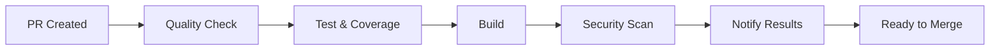
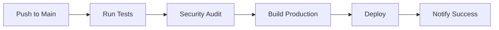

# 🚀 Configuración de GitHub Actions para A4CO DDD Microservices

## 📋 Workflows Implementados

### 1. **CI/CD Pipeline** (`.github/workflows/ci-cd.yml`)

- ✅ **Quality**: Linting, formateo y verificación de tipos
- ✅ **Test & Coverage**: Tests con cobertura y generación de reportes
- ✅ **Build**: Construcción de todos los servicios
- ✅ **Security**: Auditoría de seguridad y análisis SonarCloud
- ✅ **Notify**: Notificaciones de resultados en PRs

### 2. **Dependencies Management** (`.github/workflows/dependencies.yml`)

- ✅ **Automático**: Ejecución semanal (domingos 2:00 AM UTC)
- ✅ **Manual**: Activación manual o en cambios de dependencias
- ✅ **Security Audit**: Verificación de vulnerabilidades
- ✅ **Auto-PR**: Creación automática de PRs para actualizaciones

### 3. **Deploy** (`.github/workflows/deploy.yml`)

- ✅ **Automático**: En push a ramas principales
- ✅ **Manual**: Activación manual
- ✅ **Validación**: Tests y auditoría antes del deployment
- ✅ **Notificaciones**: Estado del deployment

## 🔧 Activación del Workflow

### **Paso 1: Habilitar GitHub Actions**

1. Ve a tu repositorio en GitHub
2. Haz clic en **Settings** → **Actions** → **General**
3. Selecciona **Allow all actions and reusable workflows**
4. Haz clic en **Save**

### **Paso 2: Configurar Secrets**

Ve a **Settings** → **Secrets and variables** → **Actions** y añade:

#### **Secrets Requeridos:**


```bash
# Token de SonarCloud (opcional pero recomendado)
SONAR_TOKEN=tu_token_de_sonarcloud

# Otros tokens según tu configuración
DOCKER_USERNAME=tu_usuario_docker
DOCKER_PASSWORD=tu_password_docker

```


#### **Variables del Repositorio:**


```bash
# Configuración del proyecto
NODE_VERSION=18
PNPM_VERSION=8

```


### **Paso 3: Configurar Branch Protection**

1. Ve a **Settings** → **Branches**
2. Haz clic en **Add rule** para `main` y `develop`
3. Marca **Require status checks to pass before merging**
4. Selecciona los checks requeridos:
   - `Code Quality`
   - `Test & Coverage`
   - `Build`
   - `Security Scan`

## 📊 Configuración de SonarCloud

### **Paso 1: Crear Proyecto en SonarCloud**

1. Ve a [sonarcloud.io](https://sonarcloud.io)
2. Crea un nuevo proyecto
3. Conecta con tu repositorio de GitHub
4. Copia el `Project Key` y `Organization Key`

### **Paso 2: Actualizar Configuración**

Edita `.github/workflows/ci-cd.yml` y actualiza:


```yaml
env:
  SONAR_TOKEN: ${{ secrets.SONAR_TOKEN }}
  SONAR_PROJECT_KEY: tu_project_key
  SONAR_ORGANIZATION: tu_organization_key

```


### **Paso 3: Configurar Quality Gate**

En SonarCloud, configura las reglas de calidad:

- **Coverage**: Mínimo 70%
- **Duplications**: Máximo 3%
- **Security Hotspots**: 0 críticos
- **Bugs**: 0 críticos

## 🔄 Flujo de Trabajo del CI/CD

### **En Pull Request:**





### **En Push a Main:**





## 📱 Comandos Locales para Testing

### **Verificar Workflow Localmente:**


```bash
# Instalar act (GitHub Actions local)
brew install act  # macOS
# o
curl https://raw.githubusercontent.com/nektos/act/master/install.sh | sudo bash

# Ejecutar workflow localmente
act pull_request
act push

```


### **Simular Diferentes Eventos:**


```bash
# Simular PR
act pull_request -e .github/workflows/ci-cd.yml

# Simular push
act push -e .github/workflows/ci-cd.yml

# Simular schedule
act schedule -e .github/workflows/dependencies.yml

```


## 🚨 Solución de Problemas

### **Error: "Workflow not found"**


```bash
# Verificar estructura de directorios
ls -la .github/workflows/

# Verificar sintaxis YAML
yamllint .github/workflows/*.yml

```


### **Error: "Permission denied"**


```bash
# Verificar permisos del repositorio
# Settings → Actions → General → Workflow permissions
# Seleccionar: "Read and write permissions"

```


### **Error: "Secret not found"**


```bash
# Verificar que el secret esté configurado
# Settings → Secrets and variables → Actions
# Añadir el secret requerido

```


### **Error: "Branch protection"**


```bash
# Verificar configuración de branch protection
# Settings → Branches → Add rule
# Configurar status checks requeridos

```


## 📈 Monitoreo y Métricas

### **GitHub Actions Insights:**

1. Ve a **Actions** en tu repositorio
2. Haz clic en **Insights**
3. Revisa:
   - **Workflow runs**: Tiempo de ejecución
   - **Job duration**: Eficiencia de cada job
   - **Success rate**: Tasa de éxito

### **SonarCloud Dashboard:**

1. Ve a tu proyecto en SonarCloud
2. Revisa:
   - **Quality Gate**: Estado general
   - **Coverage**: Cobertura de tests
   - **Issues**: Problemas de calidad
   - **Security**: Vulnerabilidades

## 🔧 Personalización Avanzada

### **Añadir Nuevos Jobs:**


```yaml
# En .github/workflows/ci-cd.yml
new-job:
  name: Custom Job
  runs-on: ubuntu-latest
  needs: [quality]

  steps:
    - name: Custom Step
      run: echo "Custom action"

```


### **Configurar Cache Personalizado:**


```yaml
- name: Cache custom data
  uses: actions/cache@v3
  with:
    path: |
      custom-cache/
      build-artifacts/
    key: ${{ runner.os }}-custom-${{ hashFiles('**/custom-file') }}

```


### **Añadir Notificaciones:**


```yaml
- name: Notify Slack
  uses: 8398a7/action-slack@v3
  with:
    status: ${{ job.status }}
    webhook_url: ${{ secrets.SLACK_WEBHOOK }}

```


## 📚 Recursos Adicionales

- [GitHub Actions Documentation](https://docs.github.com/en/actions)
- [SonarCloud Documentation](https://docs.sonarcloud.io/)
- [pnpm GitHub Actions](https://pnpm.io/ci)
- [Turbo CI/CD Integration](https://turbo.build/repo/docs/ci-cd)

## 🎯 Próximos Pasos

1. **Activar workflows** siguiendo los pasos de configuración
2. **Configurar SonarCloud** para análisis de calidad
3. **Probar con un PR** para verificar funcionamiento
4. **Configurar branch protection** para mantener calidad
5. **Monitorear métricas** para optimización continua

---

**✨ Con esta configuración, tu proyecto A4CO DDD Microservices tendrá un pipeline de CI/CD robusto y automatizado!**
