# Diagramas Técnicos - A4CO Monitoring Dashboard

## 📊 Diagrama 1: Arquitectura General del Sistema

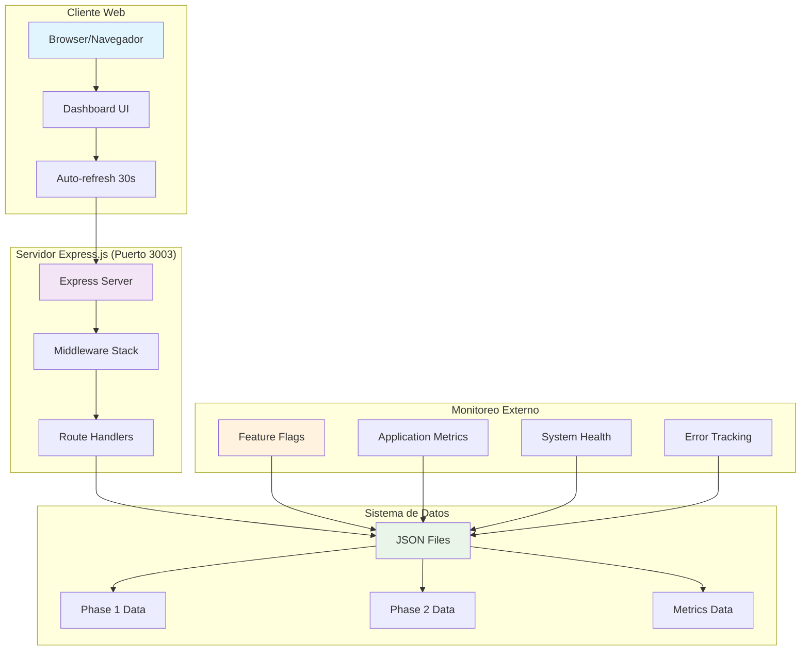

**Descripción**: Arquitectura de alto nivel mostrando la interacción entre el cliente web, servidor Express.js y sistema de datos JSON.

---

## 🔄 Diagrama 2: Flujo de Datos del Rollout

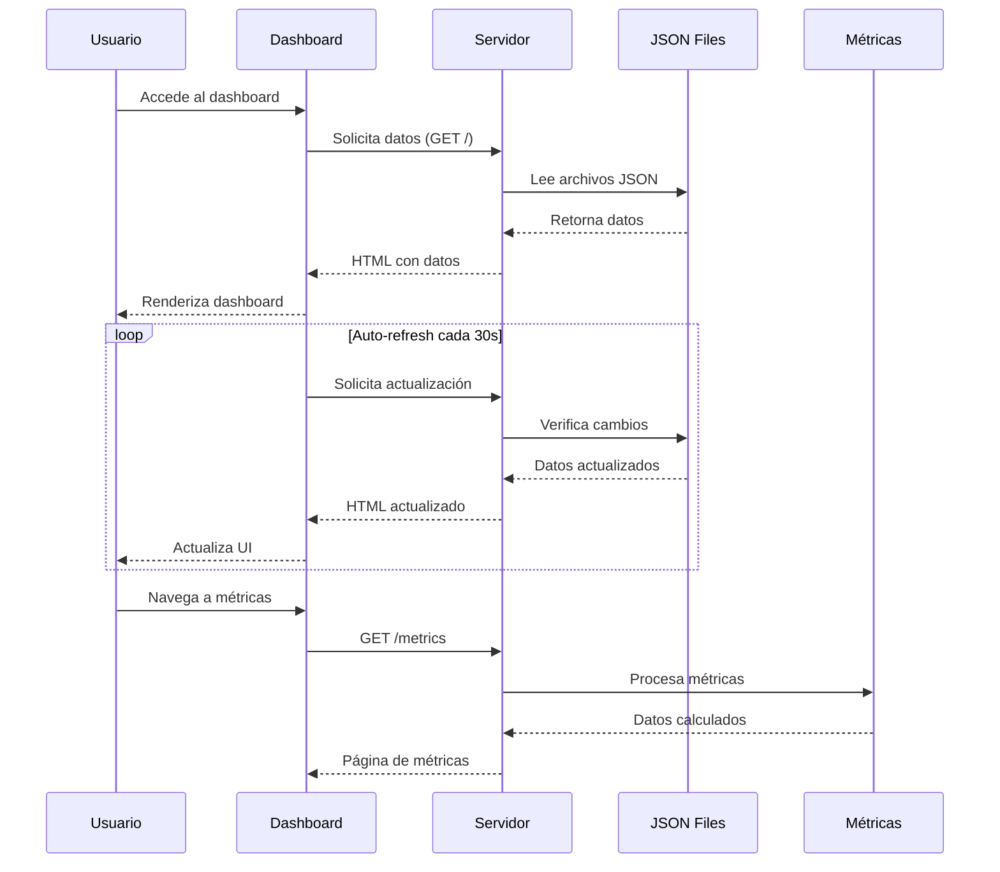

**Descripción**: Secuencia completa de cómo fluyen los datos desde los archivos JSON hasta la interfaz de usuario.

---

## 🏗️ Diagrama 3: Estructura de Clases del Servidor

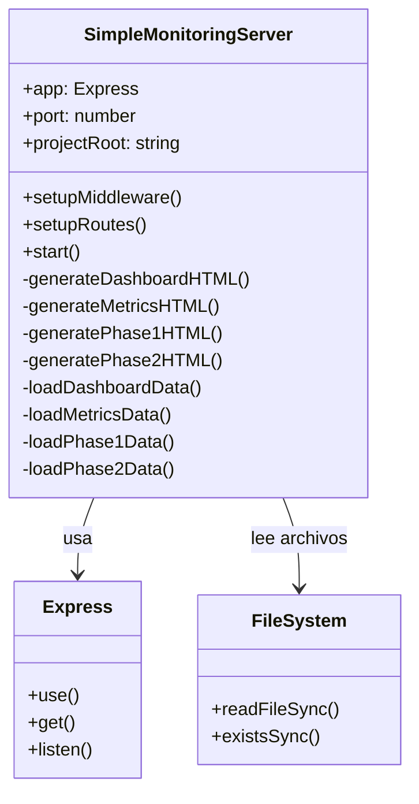

**Descripción**: Estructura de clases del servidor Express.js mostrando responsabilidades y relaciones.

---

## 📁 Diagrama 4: Estructura de Archivos JSON

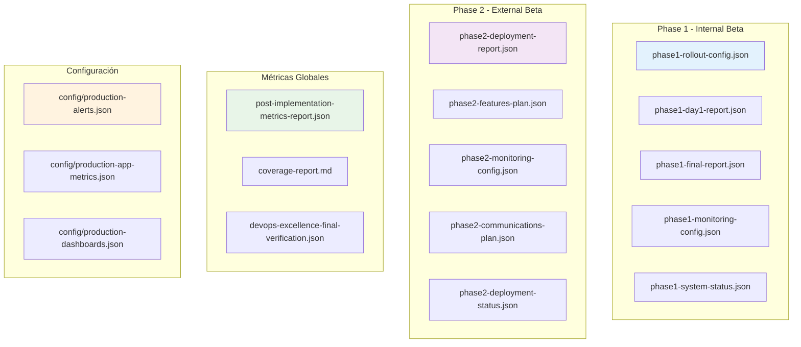

**Descripción**: Organización jerárquica de todos los archivos de datos JSON utilizados por el dashboard.

---

## 🌐 Diagrama 5: Endpoints de la API REST

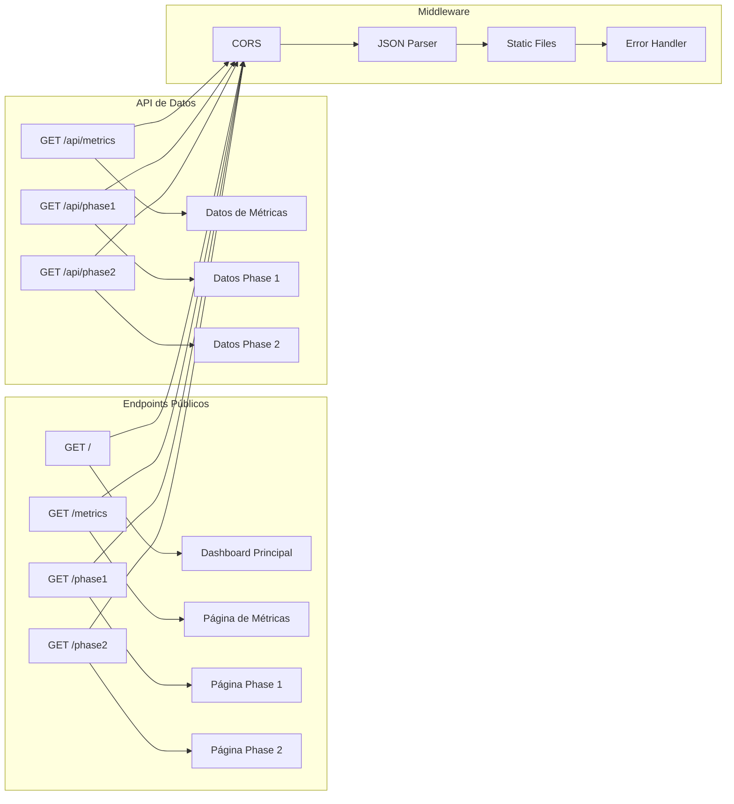

**Descripción**: Mapa completo de todos los endpoints HTTP disponibles en el servidor.

---

## 🔐 Diagrama 6: Modelo de Seguridad

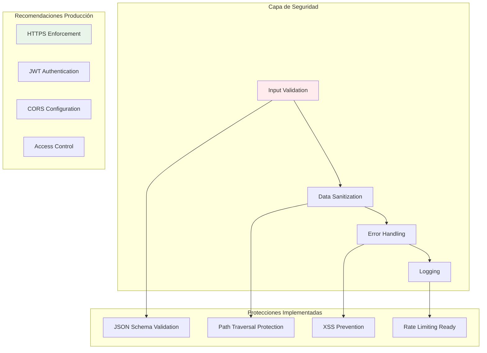

**Descripción**: Modelo de seguridad implementado y recomendaciones para entornos de producción.

---

## 📊 Diagrama 7: Dashboard de Métricas en Tiempo Real

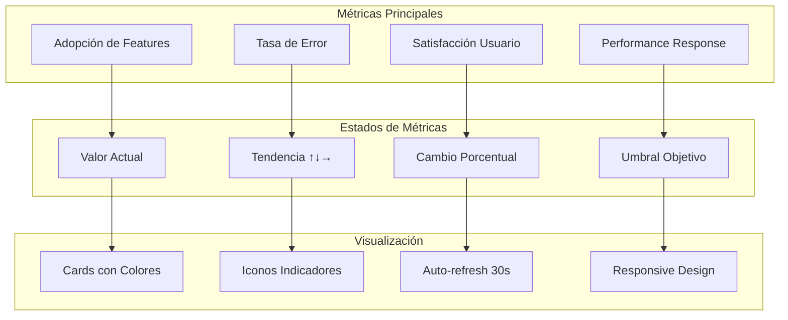

**Descripción**: Estructura del sistema de métricas en tiempo real del dashboard principal.

---

## 🚀 Diagrama 8: Flujo de Rollout Phase 1 → Phase 2

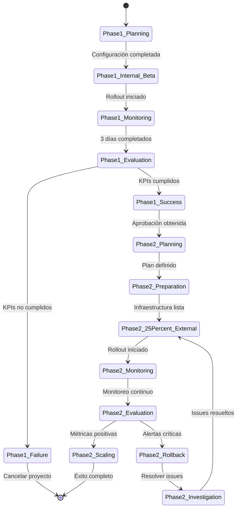

**Descripción**: Diagrama de estados completo del proceso de rollout desde Phase 1 hasta Phase 2.

---

## 👥 Diagrama 9: Roles y Responsabilidades

```mermaid
graph TD
    subgraph "Equipo de Desarrollo"
        A[Engineering Lead] --> B[Desarrollo de Features]
        C[DevOps Engineer] --> D[Infraestructura & CI/CD]
        E[QA Engineer] --> F[Testing & Validación]
    end

    subgraph "Equipo de Producto"
        G[Product Manager] --> H[Estrategia & Roadmap]
        I[Data Analyst] --> J[Métricas & Insights]
        K[UX Designer] --> L[Experiencia Usuario]
    end

    subgraph "Equipo de Operaciones"
        M[Site Reliability Engineer] --> N[Monitoreo & Alertas]
        O[Release Manager] --> P[Coordinación de Releases]
        Q[Technical Support] --> R[Soporte Usuario]
    end

    subgraph "Stakeholders"
        S[CTO] --> T[Toma de Decisiones]
        U[Engineering Manager] --> V[Supervisión Técnica]
        W[Business Owner] --> X[Aprobaciones Estratégicas]
    end

    B --> Dashboard
    D --> Dashboard
    F --> Dashboard
    H --> Dashboard
    J --> Dashboard
    N --> Dashboard
    P --> Dashboard
    T --> Dashboard
    V --> Dashboard
    X --> Dashboard
```

**Descripción**: Matriz de roles y responsabilidades en el proceso de rollout y uso del dashboard.

---

## 🔄 Diagrama 10: Ciclo de Vida de las Alertas

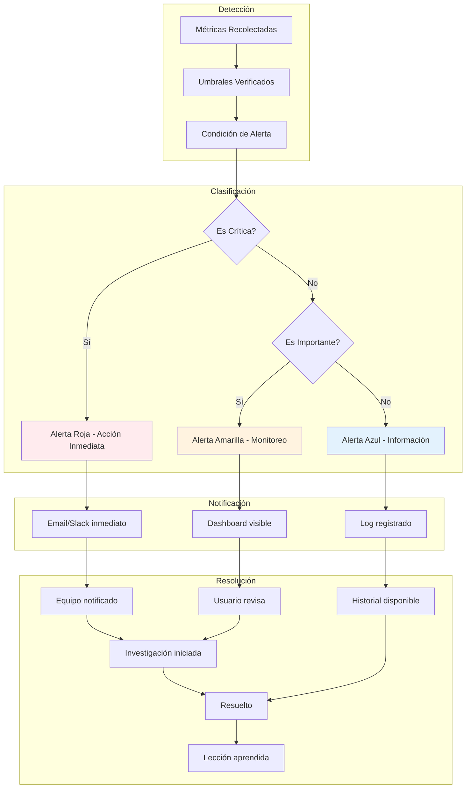

**Descripción**: Ciclo completo de vida de las alertas desde la detección hasta la resolución.

---

## 📈 Diagrama 11: Métricas DORA y DevOps Excellence

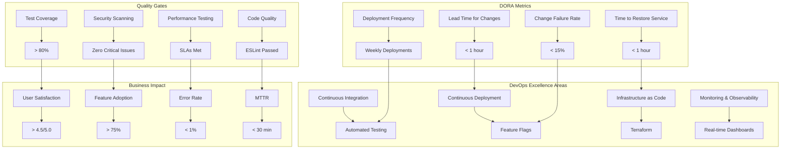

**Descripción**: Integración de métricas DORA con indicadores de calidad y impacto en el negocio.

---

## 🎯 Diagrama 12: Roadmap de Mejoras Futuras

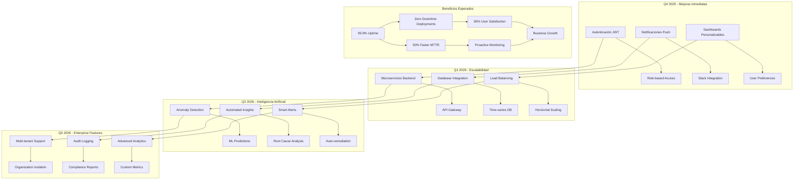

**Descripción**: Roadmap de mejoras futuras organizado por quarters con beneficios esperados.

---

## 📚 Leyenda de Diagramas

### **Colores Utilizados**

- 🔵 **Azul Claro**: Componentes del cliente/UI
- 🟣 **Morado**: Servidor y lógica de negocio
- 🟢 **Verde**: Datos y almacenamiento
- 🟠 **Naranja**: Servicios externos y monitoreo
- 🔴 **Rojo**: Alertas y estados críticos
- 🟡 **Amarillo**: Estados de advertencia
- 🔵 **Azul**: Estados informativos

### **Tipos de Diagramas**

1. **Graph TB/TD/LR**: Arquitectura y flujos de datos
2. **Sequence**: Interacciones temporales
3. **Class**: Estructuras de código
4. **State**: Estados del sistema
5. **Pie/Gantt**: Métricas y timelines

### **Convenciones**

- **Rectángulos**: Componentes del sistema
- **Círculos**: Estados o condiciones
- **Flechas**: Flujos de datos o control
- **Subgráficos**: Agrupación lógica de componentes

---

_Documentación generada automáticamente - A4CO Monitoring Dashboard v1.0_</content>
<parameter name="filePath">/Users/estudio/Projects/GitHub/MICROSERVICIOS/a4co-ddd-microservices/docs/MONITORING_DASHBOARD_DIAGRAMS.md
