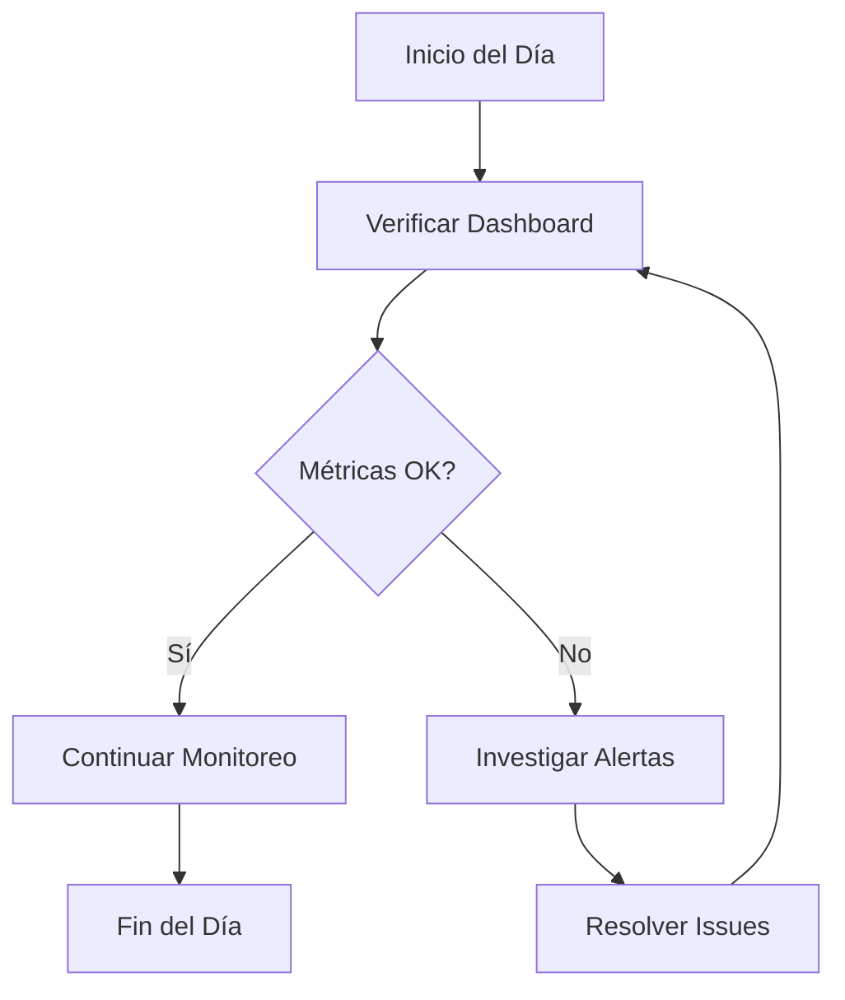
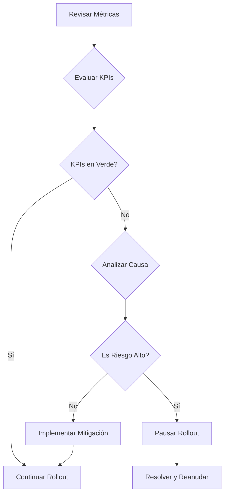

# A4CO Monitoring Dashboard - Documentación Técnica

## 📊 Visión General

El **A4CO Monitoring Dashboard** es una aplicación web en tiempo real diseñada para proporcionar visibilidad completa del proceso de rollout de features en el ecosistema de microservicios A4CO. Ofrece una interfaz intuitiva para monitorear el progreso del rollout del 25% external beta, métricas de sistema y estado operativo.

## 🎯 Casos de Uso Principales

### 1. **Monitoreo de Rollout en Tiempo Real**
**Actor**: Equipo de Operaciones / DevOps
**Descripción**: Supervisar el progreso del rollout del 25% external beta con métricas actualizadas cada 30 segundos.
**Flujo**:
1. Acceder al dashboard principal
2. Visualizar métricas clave (adopción, error rate, satisfacción)
3. Monitorear estado de servicios críticos
4. Revisar alertas activas y actividad reciente

### 2. **Análisis de Métricas Detalladas**
**Actor**: Analista de Producto / Data Analyst
**Descripción**: Profundizar en métricas específicas del rollout para identificar tendencias y patrones.
**Flujo**:
1. Navegar a la página de métricas detalladas
2. Analizar tendencias de adopción vs errores
3. Comparar datos de Phase 1 vs Phase 2
4. Exportar insights para reportes

### 3. **Revisión de Resultados de Phase 1**
**Actor**: Product Manager / Engineering Lead
**Descripción**: Evaluar los resultados del rollout interno (Phase 1) antes de proceder con Phase 2.
**Flujo**:
1. Acceder a la sección Phase 1
2. Revisar configuración del rollout
3. Analizar reporte final y recomendaciones
4. Validar criterios de éxito cumplidos

### 4. **Planificación de Phase 2**
**Actor**: Engineering Team / Release Manager
**Descripción**: Preparar y validar la planificación del rollout externo (Phase 2).
**Flujo**:
1. Explorar la sección Phase 2
2. Revisar plan de features y criterios de éxito
3. Validar configuración de monitoreo
4. Confirmar preparación de infraestructura

### 5. **Monitoreo de Salud del Sistema**
**Actor**: Site Reliability Engineer (SRE)
**Descripción**: Monitorear la salud general del sistema durante el rollout.
**Flujo**:
1. Verificar estado de servicios en el dashboard principal
2. Monitorear uptime y performance
3. Revisar alertas de sistema
4. Identificar cuellos de botella

### 6. **Toma de Decisiones Operativas**
**Actor**: Engineering Manager / CTO
**Descripción**: Tomar decisiones informadas sobre el progreso del rollout basado en datos en tiempo real.
**Flujo**:
1. Revisar métricas clave en el dashboard
2. Evaluar impacto de alertas activas
3. Comparar con benchmarks establecidos
4. Decidir sobre aceleración/pausa del rollout

## 🏗️ Arquitectura Técnica

### **Componentes Principales**

#### **1. Servidor Web Express.js**
- **Framework**: Express.js con Node.js
- **Puerto**: 3003 (configurable)
- **Endpoints**: RESTful API para datos y páginas
- **Middleware**: JSON parsing, static files, error handling

#### **2. Sistema de Templates**
- **Tecnología**: HTML puro con Tailwind CSS
- **Ventajas**: Sin dependencias complejas, rápido renderizado
- **Estilo**: Diseño moderno y responsive

#### **3. Gestión de Datos**
- **Formato**: JSON files estructurados
- **Ubicación**: Directorio raíz del proyecto
- **Actualización**: En tiempo real desde archivos

#### **4. Auto-refresh**
- **Intervalo**: 30 segundos
- **Alcance**: Todas las páginas principales
- **Implementación**: JavaScript nativo

### **Estructura de Archivos**

```
scripts/
├── simple-monitoring-server.js    # Servidor principal
└── views/                        # Templates HTML
    ├── dashboard.ejs            # Dashboard principal
    ├── metrics.ejs              # Métricas detalladas
    ├── phase1.ejs               # Resultados Phase 1
    └── phase2.ejs               # Planificación Phase 2

start-monitoring-server.sh        # Script de inicio

[Archivos de datos JSON]
├── phase1-*.json                # Datos Phase 1
├── phase2-*.json                # Datos Phase 2
└── post-implementation-*.json   # Métricas finales
```

## 📈 Métricas y KPIs

### **Métricas Clave del Dashboard**

| Métrica | Descripción | Umbral Objetivo | Frecuencia |
|---------|-------------|-----------------|------------|
| **Adopción de Features** | % de usuarios usando nuevas features | >75% | Tiempo real |
| **Tasa de Error** | % de requests con error | <1% | Tiempo real |
| **Satisfacción Usuario** | Rating promedio (1-5) | >4.5 | Diaria |
| **Performance** | Tiempo de respuesta promedio | <1500ms | Tiempo real |

### **Alertas del Sistema**

| Tipo | Condición | Severidad | Acción |
|------|-----------|-----------|--------|
| **Error Rate > 2%** | Tasa de error elevada | Alta | Revisar logs |
| **Uptime < 99.5%** | Servicio degradado | Media | Verificar estado |
| **Adopción < 70%** | Baja adopción | Baja | Monitorear tendencias |

## 🔄 Flujos de Trabajo

### **Flujo de Monitoreo Continuo**


### **Flujo de Toma de Decisiones**


## 🛡️ Consideraciones de Seguridad

### **Medidas Implementadas**
- ✅ **No exposición de datos sensibles**: Solo métricas agregadas
- ✅ **Validación de entrada**: Sanitización de datos JSON
- ✅ **HTTPS recomendado**: Para producción
- ✅ **Autenticación**: Recomendada para acceso restringido

### **Recomendaciones de Producción**
- Implementar autenticación OAuth/JWT
- Usar HTTPS obligatorio
- Configurar CORS apropiadamente
- Monitorear logs de acceso

## 📊 Diagramas Técnicos

*(Los 12 diagramas se presentan a continuación)*

---

## 🎯 Conclusión

El A4CO Monitoring Dashboard representa una solución completa para el monitoreo de rollouts de features en entornos de microservicios. Su arquitectura simple pero efectiva permite una visibilidad total del proceso, facilitando la toma de decisiones informadas y el mantenimiento de altos estándares de calidad.

**Características destacadas:**
- ✅ Interfaz intuitiva y responsive
- ✅ Actualización en tiempo real
- ✅ Cobertura completa de fases del rollout
- ✅ Arquitectura escalable y mantenible
- ✅ Sin dependencias complejas

**Próximos pasos recomendados:**
1. Implementar autenticación para acceso seguro
2. Agregar notificaciones push para alertas críticas
3. Integrar con sistemas de monitoreo existentes
4. Implementar dashboards personalizables por rol</content>
<parameter name="filePath">/Users/estudio/Projects/GitHub/MICROSERVICIOS/a4co-ddd-microservices/docs/MONITORING_DASHBOARD_DOCUMENTATION.md