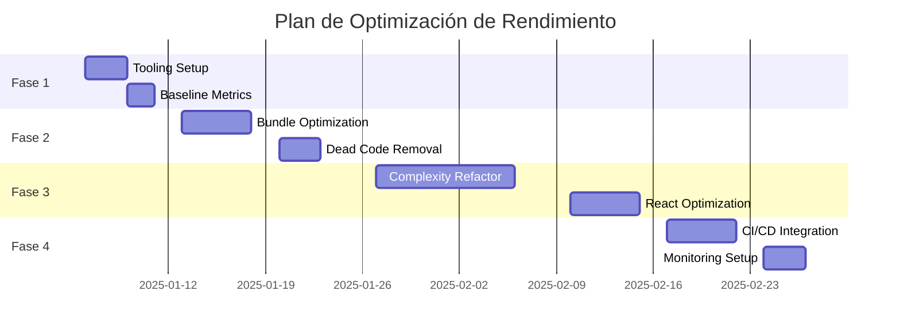

# ADR-001: Estrategia de Optimización de Rendimiento

**Fecha**: 2025-01-03  
**Estado**: Aceptado  
**Deciders**: Equipo de Arquitectura, DevOps, Frontend Lead  
**Tags**: `performance`, `optimization`, `strategy`

## Contexto y Problema

Nuestro proyecto a4co-ddd-microservices ha alcanzado ~87,529 líneas de código distribuidas en 856 archivos, con 18 microservicios en un monorepo. El análisis inicial muestra:

- Bundle size sin optimizar en Next.js (dashboard-web)
- Complejidad ciclomática elevada en capas de dominio
- Posibles re-renders innecesarios en React 19
- Tiempo de build incrementándose con cada sprint
- Sin métricas de rendimiento establecidas

Necesitamos una estrategia sistemática para abordar estos problemas sin interrumpir el desarrollo activo.

## Decisión

Implementaremos una estrategia de optimización en 4 fases, priorizando por ROI (Return on Investment):

### Fase 1: Medición y Baseline (Semana 1)

1. Implementar herramientas de análisis automatizado
2. Establecer métricas baseline
3. Identificar quick wins

### Fase 2: Quick Wins (Semanas 2-3)

1. Bundle optimization (mayor impacto)
2. Dead code elimination
3. Lazy loading crítico

### Fase 3: Refactoring Estructural (Semanas 4-6)

1. Reducción de complejidad ciclomática
2. Optimización de renders React 19
3. Resolución de dependencias circulares

### Fase 4: Monitoreo Continuo (Semana 7+)

1. CI/CD con gates de calidad
2. Dashboard de métricas
3. Alertas automáticas

## Drivers de la Decisión

- **Impacto en Usuario**: Priorizar optimizaciones que afecten directamente la experiencia
- **Esfuerzo vs Beneficio**: Quick wins primero, refactors complejos después
- **Medible**: Toda optimización debe tener métricas antes/después
- **No Disruptivo**: Cambios incrementales sin detener features

## Opciones Consideradas

### Opción 1: Big Bang Refactor

- ❌ Alto riesgo de introducir bugs
- ❌ Detiene desarrollo de features
- ❌ Difícil de medir impacto

### Opción 2: Optimización Ad-hoc

- ❌ Sin priorización clara
- ❌ Esfuerzo fragmentado
- ❌ Resultados inconsistentes

### Opción 3: Estrategia Incremental por Fases (SELECCIONADA)

- ✅ Medible y controlado
- ✅ Permite desarrollo paralelo
- ✅ ROI claro en cada fase
- ✅ Rollback posible por fase

## Consecuencias

### Positivas

- Mejora progresiva y medible del rendimiento
- Equipo aprende mejores prácticas gradualmente
- Deuda técnica se paga sistemáticamente
- Métricas claras para stakeholders

### Negativas

- Requiere disciplina para mantener el plan
- Inversión inicial en tooling
- Posible overhead en CI/CD

### Riesgos y Mitigaciones

| Riesgo                 | Probabilidad | Impacto | Mitigación                          |
| ---------------------- | ------------ | ------- | ----------------------------------- |
| Resistencia del equipo | Media        | Alto    | Mostrar quick wins temprano         |
| Regresiones            | Baja         | Alto    | Tests automatizados + feature flags |
| Scope creep            | Alta         | Medio   | ADRs específicos por fase           |

## Métricas de Éxito

- **Performance Score**: > 90 (Lighthouse)
- **Bundle Size**: < 100KB First Load JS
- **Build Time**: < 2 minutos
- **Complejidad Promedio**: < 5
- **Test Coverage**: > 80%

## Plan de Implementación

## Referencias

- [Web Vitals](https://web.dev/vitals/)
- [React 19 Performance](https://react.dev/blog/2024/04/25/react-19)
- [DDD Complexity Patterns](https://martinfowler.com/bliki/DomainDrivenDesign.html)
