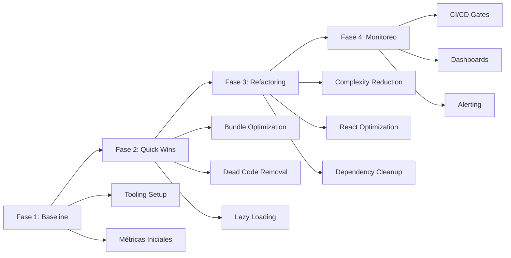

# 📋 Architecture Decision Records (ADRs)

## Resumen

Este directorio contiene los Architecture Decision Records (ADRs) para el proyecto a4co-ddd-microservices,
específicamente enfocados en la iniciativa de optimización de rendimiento para un proyecto de +87K líneas de código.

## 🎯 Objetivo

Documentar decisiones arquitecturales clave para:

- Optimizar el rendimiento de la aplicación
- Reducir la complejidad del código
- Establecer prácticas sostenibles de desarrollo
- Implementar monitoreo continuo

## 📑 Índice de ADRs

| ADR                                               | Título                                    | Estado       | Impacto                                   |
| ------------------------------------------------- | ----------------------------------------- | ------------ | ----------------------------------------- |
| [001](./001-performance-optimization-strategy.md) | Estrategia de Optimización de Rendimiento | ✅ Aceptado  | Establece el framework general de 4 fases |
| [002](./002-bundle-optimization-strategy.md)      | Estrategia de Optimización de Bundle Size | 🟡 Propuesto | -40% tiempo de carga inicial              |
| [003](./003-complexity-reduction-strategy.md)     | Estrategia de Reducción de Complejidad    | 🟡 Propuesto | -30% bugs, +50% mantenibilidad            |
| [004](./004-react-performance-optimization.md)    | Optimización de Rendimiento React 19      | 🟡 Propuesto | -60% re-renders innecesarios              |
| [005](./005-continuous-monitoring-strategy.md)    | Monitoreo Continuo de Rendimiento         | 🟡 Propuesto | MTTD < 5 minutos                          |

## 🚀 Plan de Implementación Global



## 📊 Métricas de Éxito Consolidadas

| Métrica                | Actual  | Target  | ADR Relacionado |
| ---------------------- | ------- | ------- | --------------- |
| First Load JS          | > 200KB | < 100KB | ADR-002         |
| Complejidad Promedio   | 8.5     | < 5     | ADR-003         |
| Re-renders/Interacción | 15      | < 5     | ADR-004         |
| Build Time             | > 5min  | < 2min  | ADR-001         |
| MTTD Regresiones       | Manual  | < 5min  | ADR-005         |

## 🛠️ Herramientas Core

### Análisis

- **Bundle**: @next/bundle-analyzer, webpack-bundle-analyzer
- **Complejidad**: eslint-plugin-complexity, madge, ts-prune
- **React**: React DevTools Profiler, why-did-you-render
- **Monitoreo**: Lighthouse CI, Grafana, Prometheus

### Ejecución Rápida

```bash
# Análisis completo
./scripts/impact-analysis.sh

# Análisis específicos
npx tsx scripts/bundle-killer.ts
npx tsx scripts/complexity-hotspots.ts
npx madge --circular apps/


```

## 📈 ROI Esperado

| Inversión               | Retorno                   | Período   |
| ----------------------- | ------------------------- | --------- |
| 2 devs × 6 semanas      | -40% tiempo de carga      | Inmediato |
| $3K/año infraestructura | -30% bugs en producción   | 3 meses   |
| 1 semana setup inicial  | +50% velocidad desarrollo | 6 meses   |

## 🔄 Proceso de Decisión

1. **Propuesta**: Crear borrador de ADR
2. **Revisión**: Tech Lead + Domain Experts
3. **Prueba**: POC si es necesario
4. **Aprobación**: Consenso del equipo
5. **Implementación**: Según plan definido

## 📝 Template ADR

```markdown
# ADR-XXX: [Título]

**Fecha**: YYYY-MM-DD  
**Estado**: Propuesto|Aceptado|Rechazado|Obsoleto  
**Deciders**: [Roles involucrados]  
**Tags**: `tag1`, `tag2`

## Contexto y Problema

[Descripción del problema]

## Decisión

[Solución propuesta]

## Drivers de la Decisión

[Factores clave]

## Opciones Consideradas

[Alternativas evaluadas]

## Consecuencias

[Impactos positivos y negativos]

## Referencias

[Links y recursos]
```

## 🔗 Referencias

- [ADR Tools](https://github.com/npryce/adr-tools)
- [Documenting Architecture Decisions](https://cognitect.com/blog/2011/11/15/documenting-architecture-decisions)
- [ADR GitHub Organization](https://adr.github.io/)

---

**Última actualización**: 2025-01-03  
**Mantenedor**: Equipo de Arquitectura
