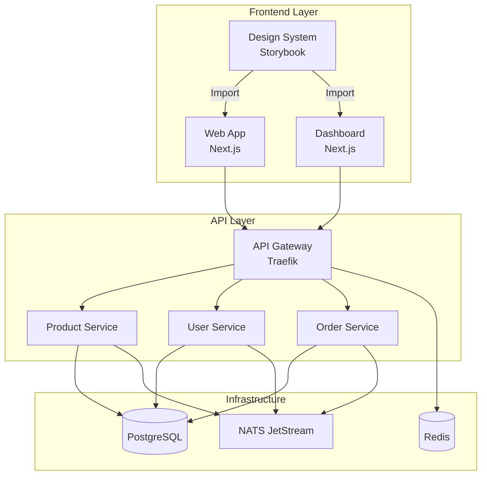

# 🚀 Servidor de Desarrollo Unificado A4CO

## Visión General

El servidor de desarrollo unificado de A4CO proporciona un entorno completo donde el diseño fluye instantáneamente a través de todo el stack tecnológico. Este documento guía a desarrolladores y diseñadores en el uso del sistema.

## 🏗️ Arquitectura





## 🚦 Inicio Rápido

### Prerrequisitos

- Node.js >= 18.0.0
- pnpm >= 8.0.0
- Docker y Docker Compose
- Git

### Instalación


```bash
# Clonar el repositorio
git clone https://github.com/Neiland85/a4co-ddd-microservices.git
cd a4co-ddd-microservices

# Instalar dependencias
pnpm install

# Configurar variables de entorno
cp .env.example .env.local


```


### Comandos Principales


```bash
# 🚀 Iniciar todo el entorno de desarrollo
pnpm dev:all

# 🎨 Iniciar solo el Design System
pnpm storybook:dev

# 🔄 Sincronizar cambios del Design System
pnpm design:sync

# 🧪 Ejecutar tests visuales
pnpm test:visual

# 📦 Build de producción
pnpm build:all


```


## 🎨 Design System

### Estructura


```


packages/design-system/
├── src/
│   ├── components/      # Componentes React
│   ├── tokens/          # Tokens de diseño
│   ├── styles/          # Estilos globales
│   ├── hooks/           # Hooks personalizados
│   └── utils/           # Utilidades
├── .storybook/          # Configuración de Storybook
├── tests/               # Tests visuales
└── tailwind.preset.js   # Preset de Tailwind


```


### Uso en Aplicaciones


```typescript
// En tu aplicación Next.js
import { Button, Card } from '@a4co/design-system';
import { colors, spacing } from '@a4co/design-system/tokens';

// tailwind.config.ts
import a4coPreset from '@a4co/design-system/tailwind';

export default {
  presets: [a4coPreset],
  // ... configuración adicional
};

```


### Hot Reload

Los cambios en el Design System se reflejan automáticamente en todas las aplicaciones gracias a:

1. **Volúmenes Docker compartidos**
2. **Webpack HMR configurado**
3. **Servicio de sincronización activo**

## 🐳 Docker Compose

### Servicios Disponibles

| Servicio          | URL                        | Descripción                |
| ----------------- | -------------------------- | -------------------------- |
| Traefik Dashboard | http://localhost:8080      | Panel de control del proxy |
| Design System     | http://design.localhost    | Storybook del DS           |
| Web App           | http://localhost           | Aplicación principal       |
| Dashboard         | http://dashboard.localhost | Panel administrativo       |
| API Gateway       | http://api.localhost       | Gateway unificado          |
| PostgreSQL        | localhost:5432             | Base de datos              |
| Redis             | localhost:6379             | Cache y sesiones           |
| NATS              | localhost:4222             | Message broker             |

### Comandos Docker


```bash
# Iniciar servicios
docker-compose -f docker-compose.dev.yml up -d

# Ver logs
docker-compose -f docker-compose.dev.yml logs -f [servicio]

# Reiniciar un servicio
docker-compose -f docker-compose.dev.yml restart [servicio]

# Detener todo
docker-compose -f docker-compose.dev.yml down

# Limpiar volúmenes
docker-compose -f docker-compose.dev.yml down -v


```


## 🔄 CI/CD

### GitHub Actions

Los workflows automatizados incluyen:

1. **Design System Preview**: Se ejecuta en cada PR
2. **Visual Testing**: Chromatic para regresión visual
3. **Build & Deploy**: Despliegue a Vercel

### Secretos Requeridos


```yaml
VERCEL_TOKEN: Token de Vercel
VERCEL_ORG_ID: ID de la organización
VERCEL_PROJECT_ID: ID del proyecto
CHROMATIC_PROJECT_TOKEN: Token de Chromatic
TURBO_TOKEN: Token de Turborepo

```


## 🧪 Testing

### Tests Visuales con Playwright


```bash
# Ejecutar todos los tests visuales
pnpm test:visual

# Actualizar snapshots
pnpm test:visual:update

# Ver reporte HTML
pnpm test:visual:report


```


### Tests de Componentes


```bash
# Tests unitarios con Vitest
pnpm test

# Modo watch
pnpm test:watch

# Coverage
pnpm test:coverage


```


## 📚 Recursos Adicionales

### Scripts Útiles


```json
{
  "scripts": {
    "dev:all": "docker-compose -f docker-compose.dev.yml up",
    "dev:frontend": "turbo run dev --filter=...web",
    "dev:backend": "turbo run dev --filter=...*-service",
    "storybook:dev": "turbo run storybook --filter=@a4co/design-system",
    "design:sync": "node scripts/sync-design-tokens.js",
    "clean:all": "turbo run clean && rm -rf node_modules",
    "reinstall": "pnpm clean:all && pnpm install"
  }
}

```


### Alias de TypeScript


```json
// tsconfig.json
{
  "compilerOptions": {
    "paths": {
      "@a4co/design-system": ["../../packages/design-system/src"],
      "@a4co/design-system/*": ["../../packages/design-system/src/*"]
    }
  }
}

```


### Configuración VSCode


```json
// .vscode/settings.json
{
  "typescript.tsdk": "node_modules/typescript/lib",
  "typescript.enablePromptUseWorkspaceTsdk": true,
  "tailwindCSS.experimental.configFile": "./tailwind.config.ts",
  "tailwindCSS.includeLanguages": {
    "typescript": "javascript",
    "typescriptreact": "javascript"
  }
}

```


## 🐛 Troubleshooting

### Problemas Comunes

1. **Hot reload no funciona**

   ```bash
   # Verificar que el servicio sync esté activo
   docker-compose logs sync-service

   # Reiniciar el servicio
   docker-compose restart sync-service
   ```

2. **Errores de permisos en Docker**

   ```bash
   # En Linux, agregar usuario al grupo docker
   sudo usermod -aG docker $USER
   ```

3. **Puerto ya en uso**

   ```bash
   # Encontrar proceso usando el puerto
   lsof -i :3000

   # Matar el proceso
   kill -9 [PID]
   ```

4. **Cambios no se reflejan**

   ```bash
   # Limpiar cache de Turbo
   pnpm turbo run clean

   # Reconstruir
   pnpm build
   ```

## 🤝 Contribución

### Flujo de Trabajo

1. Crear rama desde `develop`
2. Hacer cambios en el Design System
3. Verificar en Storybook local
4. Crear PR con descripción clara
5. Esperar preview de Vercel
6. Pasar tests visuales
7. Merge a `develop`

### Convenciones

- **Commits**: Usar [Conventional Commits](https://www.conventionalcommits.org/)
- **Branches**: `feature/`, `fix/`, `docs/`
- **PRs**: Incluir screenshots para cambios visuales

## 📞 Soporte

- **Documentación**: [docs.a4co.com](https://docs.a4co.com)
- **Discord**: [discord.gg/a4co](https://discord.gg/a4co)
- **Issues**: [GitHub Issues](https://github.com/Neiland85/a4co-ddd-microservices/issues)

---

_Última actualización: Diciembre 2024_
