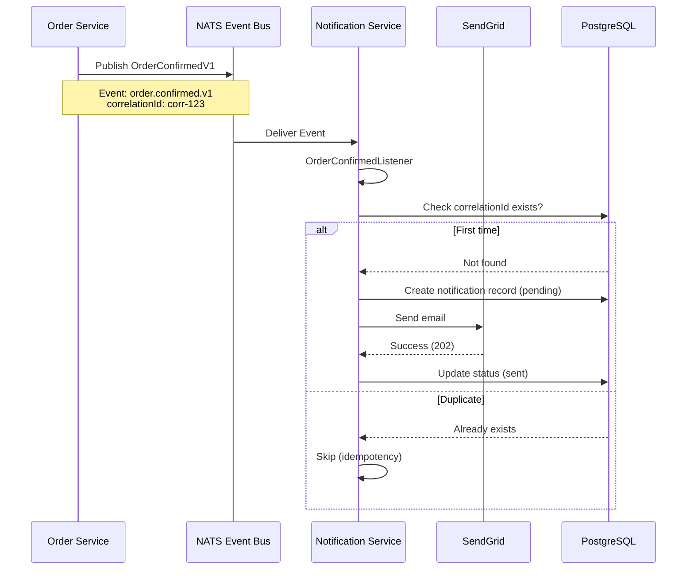
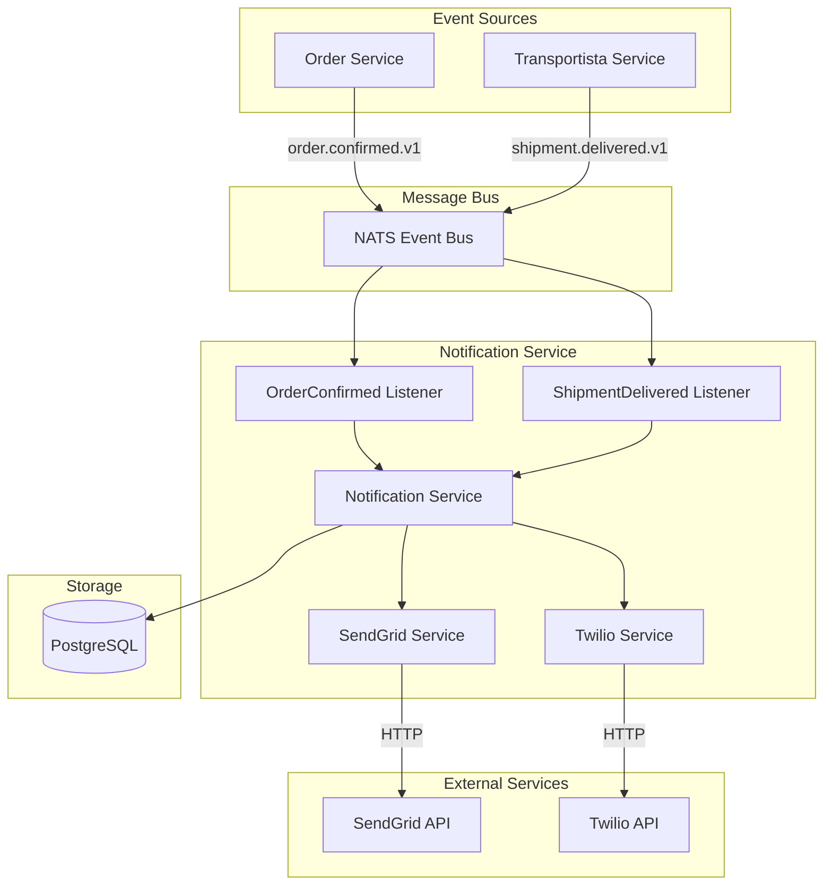

# Notification Service Event Flow Diagrams

## Order Confirmation Flow

```mermaid
sequenceDiagram
    participant OS as Order Service
    participant NATS as NATS Event Bus
    participant NS as Notification Service
    participant SG as SendGrid
    participant DB as PostgreSQL

    OS->>NATS: Publish OrderConfirmedV1
    Note over OS,NATS: Event: order.confirmed.v1<br/>correlationId: corr-123
    
    NATS->>NS: Deliver Event
    NS->>NS: OrderConfirmedListener
    
    NS->>DB: Check correlationId exists?
    alt First time
        DB-->>NS: Not found
        NS->>DB: Create notification record (pending)
        NS->>SG: Send email
        SG-->>NS: Success (202)
        NS->>DB: Update status (sent)
    else Duplicate
        DB-->>NS: Already exists
        NS->>NS: Skip (idempotency)
    end
```

## System Architecture

```mermaid
graph TB
    subgraph "Event Sources"
        OS[Order Service]
        TS[Transportista Service]
    end

    subgraph "Message Bus"
        NATS[NATS Event Bus]
    end

    subgraph "Notification Service"
        OCL[OrderConfirmed Listener]
        SDL[ShipmentDelivered Listener]
        NOS[Notification Service]
        SGS[SendGrid Service]
        TWS[Twilio Service]
    end

    subgraph "External Services"
        SG[SendGrid API]
        TW[Twilio API]
    end

    subgraph "Storage"
        DB[(PostgreSQL)]
    end

    OS -->|order.confirmed.v1| NATS
    TS -->|shipment.delivered.v1| NATS
    
    NATS --> OCL
    NATS --> SDL
    
    OCL --> NOS
    SDL --> NOS
    
    NOS --> SGS
    NOS --> TWS
    NOS --> DB
    
    SGS -->|HTTP| SG
    TWS -->|HTTP| TW
```
