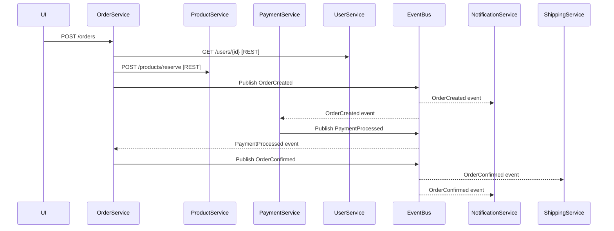
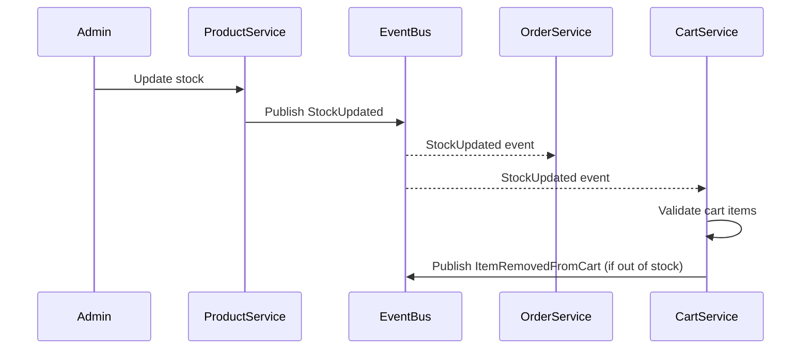

# Estrategia de Comunicación entre Microservicios

## 1. Principios de Comunicación

### Criterios de Decisión: Síncrono vs Asíncrono

**Comunicación Síncrona (REST APIs)**
- Cuando se requiere respuesta inmediata
- Para consultas de datos en tiempo real
- Validaciones que bloquean el flujo de usuario
- Operaciones que requieren confirmación instantánea

**Comunicación Asíncrona (Eventos)**
- Para notificar cambios de estado
- Operaciones que pueden procesarse en background
- Cuando múltiples servicios necesitan reaccionar a un cambio
- Para mantener consistencia eventual entre servicios

## 2. Matriz de Comunicación entre Servicios

### User Service
**APIs REST (Síncrono):**
- `GET /users/{id}` - Obtener información de usuario
- `POST /users/authenticate` - Autenticación
- `GET /users/{id}/profile` - Perfil de usuario
- `PUT /users/{id}/profile` - Actualizar perfil

**Eventos Publicados:**
- `UserRegistered` - Nuevo usuario registrado
- `UserProfileUpdated` - Perfil actualizado
- `UserDeactivated` - Usuario desactivado
- `EmailVerified` - Email confirmado

### Product Service
**APIs REST (Síncrono):**
- `GET /products` - Listar productos
- `GET /products/{id}` - Detalle de producto
- `GET /products/{id}/availability` - Verificar disponibilidad
- `POST /products/{id}/reserve` - Reservar stock (usado por Order Service)

**Eventos Publicados:**
- `ProductCreated` - Nuevo producto creado
- `ProductUpdated` - Información de producto actualizada
- `StockUpdated` - Cambio en inventario
- `ProductDiscontinued` - Producto descontinuado
- `PriceChanged` - Cambio de precio

### Order Service
**APIs REST (Síncrono):**
- `POST /orders` - Crear orden
- `GET /orders/{id}` - Obtener orden
- `GET /orders/user/{userId}` - Órdenes por usuario
- `PUT /orders/{id}/cancel` - Cancelar orden

**Eventos Publicados:**
- `OrderCreated` - Nueva orden creada
- `OrderConfirmed` - Orden confirmada
- `OrderShipped` - Orden enviada
- `OrderDelivered` - Orden entregada
- `OrderCancelled` - Orden cancelada
- `PaymentRequired` - Requiere pago

### Cart Service
**APIs REST (Síncrono):**
- `GET /carts/{userId}` - Obtener carrito
- `POST /carts/{userId}/items` - Agregar item
- `DELETE /carts/{userId}/items/{itemId}` - Quitar item
- `POST /carts/{userId}/checkout` - Iniciar checkout

**Eventos Publicados:**
- `ItemAddedToCart` - Item agregado
- `ItemRemovedFromCart` - Item removido
- `CartAbandoned` - Carrito abandonado
- `CheckoutInitiated` - Checkout iniciado

### Payment Service
**APIs REST (Síncrono):**
- `POST /payments` - Procesar pago
- `GET /payments/{id}/status` - Estado de pago
- `POST /payments/{id}/refund` - Procesar reembolso

**Eventos Publicados:**
- `PaymentProcessed` - Pago exitoso
- `PaymentFailed` - Pago fallido
- `RefundProcessed` - Reembolso procesado
- `PaymentMethodAdded` - Método de pago agregado

### Shipping Service
**APIs REST (Síncrono):**
- `POST /shipments/calculate` - Calcular costo de envío
- `GET /shipments/{id}/tracking` - Tracking de envío
- `POST /shipments` - Crear envío

**Eventos Publicados:**
- `ShipmentCreated` - Envío creado
- `ShipmentDispatched` - Envío despachado
- `ShipmentInTransit` - En tránsito
- `ShipmentDelivered` - Entregado
- `DeliveryFailed` - Fallo en entrega

### Notification Service
**Solo consume eventos, no expone APIs**

**Eventos Suscritos:**
- `OrderCreated` → Enviar confirmación de orden
- `OrderShipped` → Notificar envío
- `PaymentProcessed` → Confirmar pago
- `UserRegistered` → Email de bienvenida
- `CartAbandoned` → Recordatorio de carrito

## 3. Flujos de Comunicación Principales

### Flujo de Creación de Orden



### Flujo de Actualización de Stock



## 4. Estructura de Eventos de Dominio

### Evento Base
```typescript
interface DomainEvent {
  eventId: string;
  eventType: string;
  aggregateId: string;
  aggregateType: string;
  timestamp: Date;
  version: number;
  metadata: {
    userId?: string;
    correlationId: string;
    causationId?: string;
  };
}
```

### Ejemplos de Eventos

**OrderCreated**
```json
{
  "eventId": "evt_123",
  "eventType": "OrderCreated",
  "aggregateId": "order_456",
  "aggregateType": "Order",
  "timestamp": "2024-01-01T10:00:00Z",
  "version": 1,
  "payload": {
    "orderId": "order_456",
    "userId": "user_789",
    "items": [
      {
        "productId": "prod_111",
        "quantity": 2,
        "price": 29.99
      }
    ],
    "totalAmount": 59.98,
    "shippingAddress": { ... }
  },
  "metadata": {
    "userId": "user_789",
    "correlationId": "corr_abc"
  }
}
```

**StockReserved**
```json
{
  "eventId": "evt_124",
  "eventType": "StockReserved",
  "aggregateId": "prod_111",
  "aggregateType": "Product",
  "timestamp": "2024-01-01T10:01:00Z",
  "version": 2,
  "payload": {
    "productId": "prod_111",
    "orderId": "order_456",
    "quantity": 2,
    "reservationId": "res_222",
    "expiresAt": "2024-01-01T10:31:00Z"
  },
  "metadata": {
    "correlationId": "corr_abc",
    "causationId": "evt_123"
  }
}
```

## 5. Infraestructura de Mensajería

### Message Broker Recomendado: NATS JetStream

**Ventajas:**
- Alto rendimiento y baja latencia
- Soporte nativo para streaming
- Persistencia de mensajes
- Exactamente una vez (exactly-once) delivery
- Fácil de escalar horizontalmente

### Configuración de Topics y Subscriptions

```yaml
streams:
  - name: ORDERS
    subjects:
      - order.>
    retention: limits
    max_age: 7d
    
  - name: PRODUCTS
    subjects:
      - product.>
    retention: limits
    max_age: 30d
    
  - name: PAYMENTS
    subjects:
      - payment.>
    retention: limits
    max_age: 90d

consumers:
  - stream: ORDERS
    name: notification-service
    filter_subject: order.created
    
  - stream: ORDERS
    name: shipping-service
    filter_subject: order.confirmed
```

## 6. Patrones de Resiliencia

### Circuit Breaker para Llamadas REST
```typescript
// Configuración para cada servicio
const circuitBreakerConfig = {
  timeout: 3000,
  errorThresholdPercentage: 50,
  resetTimeout: 30000,
  volumeThreshold: 10
};
```

### Retry con Backoff para Eventos
```typescript
const retryConfig = {
  maxAttempts: 3,
  initialDelay: 1000,
  maxDelay: 10000,
  factor: 2
};
```

### Dead Letter Queue
- Eventos que fallan después de reintentos van a DLQ
- Monitoreo y alertas sobre DLQ
- Proceso manual/automático de reprocesamiento

## 7. Contratos de API y Eventos

### API Contracts (OpenAPI)
Cada servicio debe exponer su especificación OpenAPI:
- `/api-docs` - Documentación Swagger
- Versionado de APIs: `/v1/`, `/v2/`
- Validación de schemas en runtime

### Event Contracts (AsyncAPI)
Documentar eventos usando AsyncAPI:
- Schema registry centralizado
- Validación de eventos
- Evolución compatible de schemas

## 8. Monitoreo y Observabilidad

### Distributed Tracing
- Correlation IDs en todas las comunicaciones
- Trace de requests a través de servicios
- Latencia end-to-end

### Métricas Clave
- Latencia de APIs REST
- Throughput de eventos
- Tamaño de colas
- Tasa de errores por servicio

### Logging
- Logs estructurados (JSON)
- Contexto de correlación
- Niveles apropiados (debug, info, warn, error)